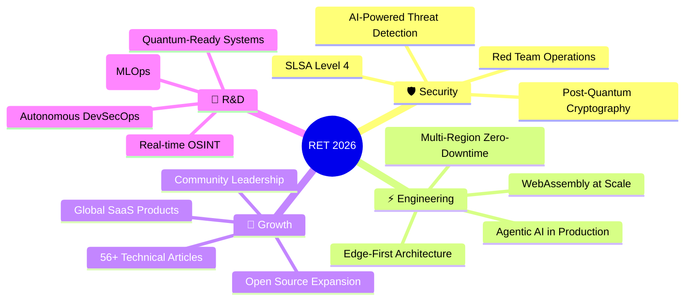

<div align="center">

<!-- HEADER BANNER -->
<a href="https://www.rettecnologia.org">

</a>

[](https://www.rettecnologia.org)
[](https://www.linkedin.com/in/devferreirag/)
[](https://dev.to/rettecnologia)
[](mailto:contato@rettecnologia.org)

</div>

---

<table>
<tr>
<td width="55%" valign="top">

### `$ whoami`

```python
class GabrielFerreira:
    role       = "Founder & Engineering Director"
    company    = "RET Tecnologia"
    location   = "Rio de Janeiro, Brasil 🇧🇷"
    languages  = ["pt-BR", "en-US", "es"]

    focus = [
        "Offensive Security & Red Team",
        "DevSecOps & Zero Trust Architecture",
        "High-Performance Web Engineering",
        "AI-Augmented Development (Agentic)",
    ]

    philosophy = "Security by Design, not as an afterthought."
```

</td>
<td width="45%" valign="top">

### 📊 Métricas de Impacto

| Métrica | Resultado |
|:---|:---|
| ⚡ Time-to-Market | **-35% TTM** |
| 💰 ROI Comprovado | **3× para clientes** |
| 🛡️ CVEs Eliminados | **-38% em produção** |
| 🖥️ Uptime SLA | **99.95%** |
| 🏆 Lighthouse | **100/100** |
| 🌍 Cascavel Framework | **12 países** |
| 📜 Certificações | **30+ internacionais** |
| ✍️ Artigos Técnicos | **56 publicados** |

</td>
</tr>
</table>

---

### 🛡️ O que a RET Tecnologia faz

> **Engenharia de software de alta performance e cibersegurança ofensiva.**  
> Construímos sistemas blindados, realizamos pentests e protegemos empresas contra ameaças digitais.

<table>
<tr>
<td align="center" width="20%">
<br/>
<sub>Next.js · React · .NET</sub>
</td>
<td align="center" width="20%">
<br/>
<sub>Pentest · OSINT · Red Team</sub>
</td>
<td align="center" width="20%">
<br/>
<sub>K8s · ArgoCD · Zero Trust</sub>
</td>
<td align="center" width="20%">
<br/>
<sub>IA · WhatsApp · Pix</sub>
</td>
<td align="center" width="20%">
<br/>
<sub>AWS · Azure · Serverless</sub>
</td>
</tr>
</table>

---

### 🔧 Arsenal Tecnológico

<details>
<summary><b>⚙️ Backend & Runtime</b></summary>
<br/>


</details>

<details>
<summary><b>🎨 Frontend & UI</b></summary>
<br/>


</details>

<details>
<summary><b>☁️ Cloud, DevOps & Infra</b></summary>
<br/>


</details>

<details>
<summary><b>🛡️ Security & Offensive</b></summary>
<br/>


</details>

<details>
<summary><b>🗄️ Data & Messaging</b></summary>
<br/>


</details>

<details>
<summary><b>📡 Observabilidade</b></summary>
<br/>


</details>

---

### 🌟 Projetos em Destaque

<table>
<tr>
<td width="50%">

**[🔒 Cascavel — Offensive Security Framework](https://github.com/glferreira-devsecops/superpowers)**  
Framework de segurança ofensiva adotado em **12 países** por profissionais de pentest.  
`Python 3.11+` `OWASP Top 10` `Modular CLI` `500+ downloads`

</td>
<td width="50%">

**[🌐 RET Tecnologia — Site Corporativo](https://www.rettecnologia.org)**  
Site com score **100/100 Lighthouse**, PWA nativo, SEO nuclear e DevSecOps pipeline.  
`Next.js 15` `TypeScript` `Vercel Edge` `CSP Strict`

</td>
</tr>
<tr>
<td width="50%">

**[💱 Cotação PRO — Fintech PWA](https://github.com/glferreira-devsecops/cotacao-pro)**  
PWA de câmbio em tempo real com **100/100 Lighthouse** e < 0.8s First Paint.  
`React 18` `WebSocket` `Zustand` `PWA Offline-First`

</td>
<td width="50%">

**[🚀 ApiSpring — Enterprise E-commerce](https://github.com/glferreira-devsecops/apispring)**  
Plataforma enterprise com **90% test coverage** e grade A no SonarQube.  
`Java 21` `Spring Boot 3` `Kafka` `CQRS` `PostgreSQL`

</td>
</tr>
</table>

---

### 📊 GitHub Analytics

<div align="center">

<a href="https://github.com/glferreira-devsecops">
  
</a>
<a href="https://github.com/glferreira-devsecops">
  
</a>

<br/>

<a href="https://github.com/glferreira-devsecops">
  
</a>

</div>

---

### 🏛️ Pilares de Excelência

<table>
<tr>
<td width="25%" align="center">

**🛡️ DevSecOps**  
<sub>SAST/DAST · SLSA 3 · Zero Trust<br/>Supply Chain Security<br/>-38% CVEs em produção</sub>

</td>
<td width="25%" align="center">

**⚡ Performance**  
<sub>100/100 Lighthouse · Sub-100ms APIs<br/>Edge Computing · CDN Multi-Tier<br/>35% faster TTM</sub>

</td>
<td width="25%" align="center">

**🏗️ Arquitetura**  
<sub>Microservices · Event-Driven<br/>DDD · CQRS · Service Mesh<br/>99.95% Uptime SLA</sub>

</td>
<td width="25%" align="center">

**🧪 QA & Compliance**  
<sub>90%+ Test Coverage · SOC2<br/>ISO 27001 · LGPD · GDPR<br/>Pipeline 100% automatizado</sub>

</td>
</tr>
</table>

---

### 📜 Certificações

<details>
<summary><b>30+ Certificações Internacionais — Cloud, Security & DevOps</b></summary>
<br/>

**☁️ Cloud & Infrastructure**


**🛡️ Security & DevSecOps**


**🚀 DevOps & Automation**


**💻 Development**


> 💡 **Lifelong Learner:** Investindo **10+ horas/semana** em tecnologias emergentes, contribuindo para open-source e escrevendo artigos técnicos.

</details>

---

### ✍️ Artigos Recentes no Dev.to

<!-- BLOG-POST-LIST:START -->
- 🔐 [OSINT: Sua Empresa Está Nua na Internet e Você Nem Sabe](https://dev.to/rettecnologia)
- 🛡️ [Zero Trust Não É Buzzword: Como Implementar Segurança Real em 2026](https://dev.to/rettecnologia)
- ⚡ [Edge Computing em 2026: A Arquitetura Que Transformou Latência em Lucro](https://dev.to/rettecnologia)
- 🤖 [Arquitetura Agêntica: Como Colocar IA Autônoma em Produção Sem Explodir Seu Sistema](https://dev.to/rettecnologia)
- 🔒 [DevSecOps Shift-Left: Por Que 87% das Empresas Vão Sofrer Ataques em 2026](https://dev.to/rettecnologia)
<!-- BLOG-POST-LIST:END -->

> **[📚 Todos os 56 artigos →](https://dev.to/rettecnologia)**

---

### 🎯 Visão 2026



---

<div align="center">

### 🤝 Vamos construir algo inquebrável?

**A RET Tecnologia não vende código — vende blindagem.**

[](https://www.rettecnologia.org/#contact)
[](https://wa.me/5521979364932)
[](https://dev.to/rettecnologia)

---

<sub>

`🌍 PT-BR · EN-US · ES` · `📍 Rio de Janeiro, Brasil` · `⏰ GMT-3 (BRT)`

**"Security by Design, not as an afterthought."**

</sub>


</div>
