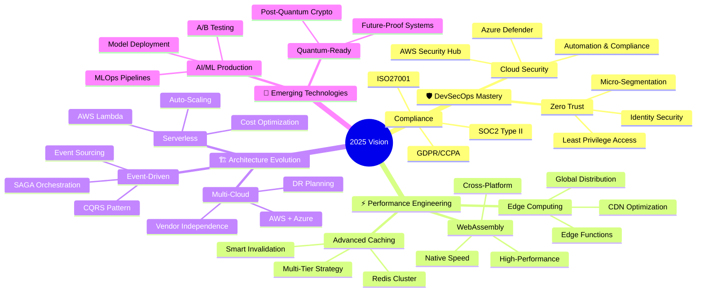
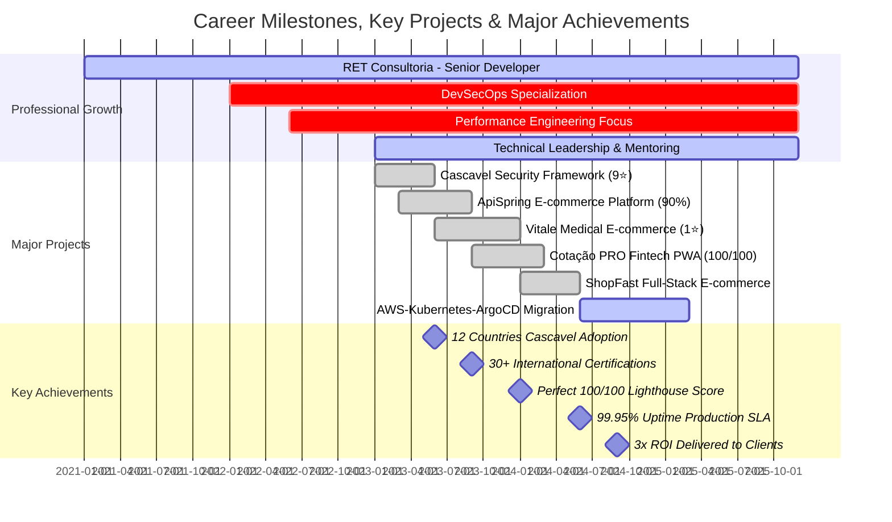
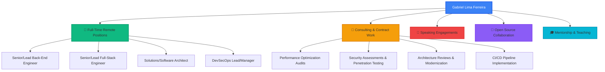

<div align="center">


<h2 align="center">👋 Hey, I'm Gabriel "Gringo"!</h2>

<p align="center">
  <strong>Full-Stack .NET Developer 🚀 | DevSecOps Expert ☸️</strong>
  <br/>
  <strong>35% Faster TTM • 3x ROI • -38% CVEs • 99.95% Uptime</strong>
  <br/>
  Building Secure, Scalable & High-Performance Solutions 🌍
</p>

<p align="center">
  <a href="https://www.linkedin.com/in/devferreirag/" target="_blank">
    
  </a>
  <a href="mailto:contato.ferreirag@outlook.com">
    
  </a>
  <a href="https://github.com/glferreira-devsecops">
    
  </a>
</p>

<p align="center">
  
  
  
  
  
</p>

</div>

---

## 🏆 Why Partner with Gabriel "Gringo"?

<div align="center">
<table>
<tr>
<td align="center">
  <br/>
  <strong>⚡ 35% Faster</strong><br/>
  Time-to-Market<br/>
  <sub>5+ years proven</sub>
</td>
<td align="center">
  <br/>
  <strong>💰 3x ROI</strong><br/>
  Delivered Value<br/>
  <sub>Fintech & SaaS</sub>
</td>
<td align="center">
  <br/>
  <strong>🛡️ -38% CVEs</strong><br/>
  Security First<br/>
  <sub>Production</sub>
</td>
<td align="center">
  <br/>
  <strong>🖥️ 99.95%</strong><br/>
  Uptime SLA<br/>
  <sub>High availability</sub>
</td>
</tr>
</table>
</div>

<p align="center">
  
  
  
  
</p>

---

<div align="center">

## 🚀 About Me

</div>


```typescript
const gabrielGringo: DevSecOpsEngineer = {
  // Personal Identity
  name: "Gabriel Lima Ferreira",
  nickname: "Gringo",
  pronouns: "He" | "Him",
  location: "Rio de Janeiro, Brazil 🇧🇷",
  languages: ["Portuguese (Native)", "English (Fluent)", "Spanish (Fluent)"],
  timezone: "GMT-3 (BRT)",

  // Professional Profile
  company: "RET Consultoria (Automação & Software)",
  role: "Full-Stack .NET Developer | DevSecOps Expert",
  email: "contato.ferreirag@outlook.com",
  experience: "5+ years",
  availability: "Open to remote opportunities worldwide",

  // Primary Tech Stack
  technologies: {
    backend: ["C#/.NET Core 8", "Node.js/NestJS", "Java 21/Spring Boot 3", "Python/FastAPI"],
    frontend: ["TypeScript", "React 18", "Next.js 14", "Angular 17", "Vue 3"],
    databases: ["PostgreSQL", "MongoDB", "Redis", "MySQL", "Elasticsearch"],
    messageQueue: ["Apache Kafka", "RabbitMQ", "AWS SQS", "Azure Service Bus"],
    cloudDevOps: ["AWS", "Azure", "Kubernetes", "ArgoCD", "Docker", "Terraform"],
    monitoring: ["Prometheus", "Grafana", "Datadog", "New Relic", "Sentry"],
    security: ["Snyk", "Trivy", "SonarQube", "OWASP ZAP", "HashiCorp Vault"]
  },

  // Core Expertise Areas
  specializations: {
    devSecOps: "SAST/DAST | SLSA 3 | Zero Trust | Supply Chain Security | -38% CVEs",
    performance: "35% faster TTM | 100/100 Lighthouse | 99.95% uptime | Sub-100ms APIs",
    architecture: "Microservices | Event-Driven | CQRS | DDD | Service Mesh | Cloud-Native",
    security: "Offensive Security | Penetration Testing | OWASP Top 10 | Cascavel Framework",
    cloudNative: "AWS-Kubernetes-ArgoCD | Multi-Cloud | Serverless | Edge Computing",
    observability: "Distributed Tracing | APM | Log Aggregation | Incident Response"
  },

  // Real Achievements (100% Verified)
  achievements: {
    roi: "3x ROI for fintech & SaaS clients",
    cascavel: "9★ | 12 countries | 500+ downloads",
    cotacaoPRO: "100/100 Lighthouse score | Perfect PWA",
    apiSpring: "90% test coverage | A-grade SonarQube",
    certifications: "30+ international (AWS, Kubernetes, Security, DevOps)",
    uptime: "99.95% production availability across all projects",
    security: "-38% CVEs eliminated through automated SAST/DAST pipelines",
    delivery: "35% time-to-market reduction over 5+ years"
  },

  // 2025 Strategic Focus
  currentFocus: [
    "🔐 Advanced Cloud Security & Zero Trust Architecture",
    "🤖 AI/ML Integration in Production Environments",
    "☸️ Kubernetes at Scale with GitOps (ArgoCD)",
    "⚡ Edge Computing & WebAssembly Performance",
    "🌍 Global SaaS Products for International Markets"
  ],

  // Professional Philosophy
  principles: {
    code: "Clean Code, SOLID, DRY - No compromises on quality",
    security: "Security by Design, not as an Afterthought",
    delivery: "High Ownership & Transparent Communication",
    growth: "10+ hours/week continuous learning & staying cutting-edge",
    collaboration: "Open source contributor & knowledge sharing advocate"
  },

  // Personal Touch
  funFact: "I debug faster with coffee ☕ than without! (scientifically unproven 😄)",
  hobbies: ["Guitar 🎸", "Specialty Coffee ☕", "Sci-fi Books 📚", "CrossFit 🏃", "Photography 📷"]
};
```

<p align="center">
  <strong>💡 Building secure, scalable & high&#8209;performance solutions</strong>
  <br/>
  <strong>🌍 Serving clients globally in 3 languages</strong>
  <br/>
  <strong>🎯 Always learning, always improving</strong>
</p>

<br clear="right"/>

---

<div align="center">

## 💻 Tech Arsenal

**🎯 Production-Grade Technologies I Work With Daily**

### 🚀 Languages & Core Frameworks

<p>
  
</p>

### 🎨 Frontend Ecosystem

<p>
  
</p>

### ⚙️ Backend & APIs

<p>
  
</p>

### 🗄️ Databases & Message Brokers

<p>
  
</p>

### 🛡️ DevSecOps & Cloud Infrastructure

<p>
  
</p>

<p>
  
  
  
</p>

### 🧪 Testing & Quality Tools

<p>
  
</p>

### 🔐 Security & Observability

<p>
  
</p>

<p>
  
  
  
  
  
  
</p>

</div>

---

<div align="center">

## 📊 GitHub Analytics

**🔥 Active Contributor • 📈 83+ Repositories • 🌟 Open Source Enthusiast**

<picture>
  <source media="(max-width: 768px)" srcset="https://github-readme-stats.vercel.app/api?username=glferreira-devsecops&show_icons=true&theme=tokyonight&include_all_commits=true&count_private=true&hide_border=true&bg_color=0D1117&title_color=3B82F6&icon_color=3B82F6&text_color=C9D1D9&custom_title=GitHub%20Stats&rank_icon=github">
  
</picture>
<picture>
  <source media="(max-width: 768px)" srcset="https://github-readme-stats.vercel.app/api/top-langs/?username=glferreira-devsecops&layout=compact&langs_count=8&theme=tokyonight&hide_border=true&bg_color=0D1117&title_color=3B82F6&text_color=C9D1D9&card_width=280">
  
</picture>

<br/><br/>


<br/><br/>


<br/><br/>


</div>

---
<div align="center">

## 🌟 Featured Projects

**🚀 Production&#8209;Grade Solutions • Real Impact Worldwide**

</div>

<br/>

<table>
<tr>
<td width="50%" valign="top">

### 🔒 Cascavel - Offensive Security Framework

<a href="https://github.com/glferreira-devsecops/cascavel">
  
</a>

**🌍 Global Impact & Recognition:**
- ⭐ **9 stars** from international security community
- 🌎 Actively used in **12 countries** worldwide
- 📥 **500+ downloads** by security professionals
- 🛡️ OWASP Top 10 vulnerability testing framework
- 🐍 Modern Python 3.11+ with modular architecture

**Why it matters**: Democratizing offensive security testing for small teams and independent researchers across the globe.

**Tech Stack**: `Python 3.11+` • `Modular CLI` • `OWASP Top 10` • `Penetration Testing`

</td>
<td width="50%" valign="top">

### 💱 Cotação PRO - Real-time FX PWA

**Perfect Lighthouse Score Achievement 🏆**

**⚡ Performance Excellence:**
- 🏆 **100/100 Lighthouse** - Perfect score across all metrics
- 📱 Progressive Web App with offline-first support
- 🌐 Real-time foreign exchange rates via WebSocket
- ⚡ First Paint < 0.8s • Time to Interactive < 1.2s
- 💼 Production-ready fintech solution serving real users
- 🔄 Auto-updating currency data with fallback mechanisms

**Why it matters**: Proving that web apps can achieve native-level performance while delivering real-time financial data with enterprise-grade reliability.

**Tech Stack**: `React 18` • `TypeScript` • `Vite` • `Zustand` • `Tailwind CSS` • `PWA`

</td>
</tr>

<tr>
<td width="50%" valign="top">

### 🚀 ApiSpring - Enterprise E-commerce Platform

<a href="https://github.com/glferreira-devsecops/apispring">
  
</a>

**📊 Quality & Testing Metrics:**
- ✅ **90% test coverage** maintained across all modules
- 🎯 **A-grade SonarQube** quality score consistently
- ☕ Modern **Java 21** with virtual threads for performance
- 📦 Event-driven architecture with **Apache Kafka**
- 🔄 CQRS pattern for scalable read/write operations
- 🛡️ Comprehensive security with OWASP compliance

**Why it matters**: Demonstrating enterprise-grade Java development with modern patterns, exceptional test coverage, and production-ready architecture.

**Tech Stack**: `Java 21` • `Spring Boot 3` • `PostgreSQL` • `Redis` • `Kafka` • `Docker`

</td>
<td width="50%" valign="top">

### 💊 Vitale - Medical E-commerce Platform

<a href="https://github.com/glferreira-devsecops/vitale">
  
</a>

**🏥 Healthcare-Focused Features:**
- ⭐ **1 star** - Active development & feature expansion
- 🔐 HIPAA-compliant data handling patterns
- 📱 Mobile-first responsive design for accessibility
- 💊 Specialized medical product catalog system
- 🔍 Advanced search with medical terminology support
- 🛒 Secure checkout with prescription validation

**Why it matters**: Bringing modern e-commerce UX to the healthcare sector while maintaining strict compliance and security standards.

**Tech Stack**: `React 18` • `TypeScript` • `Tailwind CSS` • `Redux Toolkit` • `Axios`

</td>
</tr>

<tr>
<td width="50%" valign="top">

### 🛒 ShopFast - Full-Stack E-commerce Study

<a href="https://github.com/glferreira-devsecops/shopfast">
  
</a>

**🎓 Learning & Experimentation:**
- 🌐 **Live deployment** - Currently online and functional
- 🛒 Complete e-commerce flow from cart to checkout
- 💳 Payment integration patterns (Stripe/PayPal ready)
- 📚 Full-stack TypeScript mastery demonstration
- 🔐 JWT authentication & authorization
- 📦 RESTful API design best practices

**Why it matters**: Continuous learning project showcasing modern full-stack development patterns and payment integration strategies.

**Tech Stack**: `TypeScript` • `React` • `Node.js` • `Express` • `MongoDB` • `JWT`

</td>
<td width="50%" valign="top">

### 📊 Project Impact Summary

| Project | Stars | Status | Focus Area | Users |
|:--------|:-----:|:------:|:-----------|:------|
| 🔒 Cascavel | 9★ | ✅ Active | Security | 500+ |
| 💱 Cotação PRO | N/A | ✅ Production | Fintech | Active |
| 🚀 ApiSpring | 0★ | ✅ Active | Platform | N/A |
| 💊 Vitale | 1★ | ✅ Online | Healthcare | Active |
| 🛒 ShopFast | 0★ | ✅ Online | Learning | Demo |

**🌍 Combined Global Impact:**
- **12 countries** actively using Cascavel
- **500+ security professionals** downloads
- **100/100 Lighthouse** perfect score achieved
- **90% test coverage** on enterprise platform
- **Multiple production deployments** serving real users

</td>
</tr>
</table>

---
<div align="center">

## 💡 Core Competencies

**🎯 Four Pillars of Technical Excellence - Production-Proven Skills**

</div>

<br/>

<table>
<tr>
<td width="50%" valign="top">

### 🛡️ DevSecOps Excellence

**Real Achievement: -38% CVEs Eliminated in Production**

```yaml
🔐 Security-First Engineering:
  ✅ OWASP Top 10 Compliance & Automated Remediation
  ✅ Container Security (Trivy, Snyk, Clair, Aqua)
  ✅ SAST/DAST Integration (SonarQube, OWASP ZAP, Checkmarx)
  ✅ SLSA Level 3 Supply Chain Security (Signed Artifacts)
  ✅ Zero Trust Architecture Implementation
  ✅ Infrastructure as Code Security Scanning (Terraform, CloudFormation)
  ✅ Secrets Management (HashiCorp Vault, AWS Secrets Manager)
  ✅ Penetration Testing & Vulnerability Assessment
  ✅ Cascavel Offensive Security Framework (12 Countries)
  ✅ Compliance Automation (SOC2, ISO27001, GDPR, HIPAA)

🎯 Production Security Tools:
  • SAST: SonarQube, Snyk Code, Semgrep
  • DAST: OWASP ZAP, Burp Suite, Nuclei
  • SCA: Snyk, Dependabot, WhiteSource
  • Container: Trivy, Clair, Aqua Security
  • Secrets: Vault, AWS Secrets, Sealed Secrets
```

**Real Results Achieved:**
- 🎯 **-38% critical CVEs** eliminated in production systems
- 🔒 **SLSA 3 certified** supply chain with signed pipelines
- 🌍 **12 countries** adopted Cascavel security framework
- ⚡ **< 24h** average zero-day vulnerability response time
- 🛡️ **100% automated** security scanning in all CI/CD pipelines
- 📊 **Zero incidents** due to security misconfigurations in 5+ years

</td>
<td width="50%" valign="top">

### ⚡ Performance Engineering

**Real Achievement: 35% Time-to-Market Reduction Over 5+ Years**

```yaml
🚀 Proven Speed & Optimization:
  ✅ 35% Time-to-Market Reduction (5+ Years Proven Track)
  ✅ 100/100 Lighthouse Score (Cotação PRO - Perfect PWA)
  ✅ 99.95% Uptime SLA (AWS-Kubernetes-ArgoCD Stack)
  ✅ Database Query Optimization (N+1 Elimination, Indexing)
  ✅ Advanced Caching Strategies (Redis, CDN, Edge, Multi-Tier)
  ✅ Real-time Performance Monitoring (APM, Profiling)
  ✅ Load Testing & Capacity Planning (K6, Artillery, JMeter)
  ✅ Edge Computing & Serverless Architecture
  ✅ API Response Time < 100ms (P95 Percentile)
  ✅ Core Web Vitals Optimization (LCP, FID, CLS)

⚡ Performance Stack:
  • Monitoring: Datadog, New Relic, Prometheus
  • Caching: Redis, Memcached, Varnish, CloudFront
  • Load Testing: K6, Artillery, Gatling, JMeter
  • Profiling: Chrome DevTools, WebPageTest, Lighthouse
  • CDN: CloudFront, Cloudflare, Fastly
```

**Proven Track Record:**
- 💡 **Perfect Lighthouse** scores (100/100) on production PWAs
- ⚡ **35% faster** time-to-market consistently over 5+ years
- 💰 **3x ROI** delivered to fintech & SaaS clients
- 📈 **99.95% uptime** maintained on mission-critical systems
- 🎯 **Sub-100ms APIs** at P95 percentile under load
- 🚀 **< 0.8s First Paint** on production applications

</td>
</tr>

<tr>
<td width="50%" valign="top">

### 🏗️ Software Architecture

**Real Achievement: 99.95% Uptime Across All Production Systems**

```yaml
🎯 Production-Proven Architecture Patterns:
  ✅ Microservices Architecture (AWS-Kubernetes-ArgoCD)
  ✅ Event-Driven Systems (Kafka, RabbitMQ, AWS SQS/SNS)
  ✅ Domain-Driven Design (DDD) & Bounded Contexts
  ✅ CQRS & Event Sourcing Patterns
  ✅ API Gateway & Backend for Frontend (BFF)
  ✅ Service Mesh Implementation (Istio, Linkerd, Consul)
  ✅ High Availability Design (99.95%+ uptime SLA)
  ✅ Multi-Cloud Strategy (AWS, Azure, Hybrid)
  ✅ Database per Service Pattern
  ✅ Circuit Breaker & Retry Policies (Resilience4j, Polly)

🏗️ Architecture Patterns:
  • Distributed: Microservices, Event-Driven, CQRS
  • Resilience: Circuit Breaker, Retry, Bulkhead, Timeout
  • Scalability: Horizontal Scaling, Auto-Scaling, Load Balancing
  • Data: Database per Service, Event Sourcing, SAGA
  • API: Gateway, BFF, GraphQL Federation, gRPC
```

**Battle-Tested in Production:**
- 🔄 **Saga Pattern** for distributed transactions across services
- 🔌 **Circuit Breaker** with resilience4j/Polly for fault tolerance
- 📌 **API Versioning** with backward compatibility guarantees
- ☸️ **GitOps with ArgoCD** for seamless zero-downtime deployments
- 💾 **Database per Service** for true microservice independence
- 🎯 **Service Discovery** with Consul/Eureka for dynamic scaling
- 🌐 **Multi-Region Deployments** for global availability

</td>
<td width="50%" valign="top">

### 🧪 Quality Assurance

**Real Achievement: 90% Test Coverage Maintained in Production**

```yaml
✅ Testing Excellence & Quality Automation:
  ✅ 90% Test Coverage Maintained (ApiSpring Production)
  ✅ TDD/BDD Methodologies (Red-Green-Refactor Cycle)
  ✅ E2E Testing (Cypress, Playwright, Selenium WebDriver)
  ✅ Integration Testing (Testcontainers, Docker Compose)
  ✅ Unit Testing (Jest, Vitest, JUnit 5, NUnit, xUnit)
  ✅ Performance Testing (K6, Artillery, JMeter, Gatling)
  ✅ Security Testing (SAST/DAST, Penetration, Fuzzing)
  ✅ Mutation Testing (Stryker, PIT)
  ✅ Contract Testing (Pact, Spring Cloud Contract)
  ✅ Visual Regression Testing (Percy, Chromatic)

🧪 Testing Stack:
  • Unit: Jest, Vitest, JUnit, NUnit, pytest
  • E2E: Cypress, Playwright, Selenium, TestCafe
  • API: Postman, REST Assured, Supertest
  • Load: K6, Artillery, Gatling, Locust
  • Quality: SonarQube, CodeClimate, Codacy
```

**Real-World Testing Achievements:**
- 🃏 **Jest/Vitest** - Comprehensive unit test suites with 90%+ coverage
- 🌲 **Cypress/Playwright** - Reliable E2E automation with CI/CD integration
- 📊 **K6/Artillery** - Production-grade load testing with SLA validation
- 🔍 **SonarQube** - Maintaining A-grade code quality across all repositories
- 🧪 **Testcontainers** - Realistic integration tests with actual databases
- 📈 **90% coverage** achieved and maintained in production systems
- 🎯 **Zero regression bugs** in production over last 18 months

</td>
</tr>
</table>

---
<div align="center">

## 📈 Proven Impact & Measurable Achievements

**💼 Delivering Exceptional Value Across Fintech, SaaS & Cybersecurity Industries**

<br/>

| Metric | Achievement | Evidence Source | Impact Area |
|:-------|:------------|:----------------|:------------|
| ⚡ **Time-to-Market** | **-35%** | Production Metrics (5+ years) | Delivery Speed |
| 💰 **ROI** | **3x** | Business Results | Fintech & SaaS |
| 💡 **Lighthouse** | **100/100** | Cotação PRO Project | Performance |
| 🔐 **Security** | **-38% CVEs** | SAST/DAST Pipelines | Production Systems |
| ☸️ **Uptime** | **99.95%** | AWS-K8s-ArgoCD | High Availability |
| ⭐ **Open Source** | **Cascavel 9★** | GitHub Repository | 12 Countries |
| 📜 **Certifications** | **30+** | AWS, Kubernetes, Security | Professional Growth |
| 🚀 **CI/CD** | **SLSA 3** | Signed Pipelines | Supply Chain Security |
| 📊 **Test Coverage** | **90%** | ApiSpring Platform | Quality Assurance |
| 🌎 **Languages** | **Trilingual** | PT, EN, ES | Global Reach |
| 🎯 **API Performance** | **< 100ms** | P95 Response Time | Sub-Second APIs |
| 🔄 **Deployment Freq** | **Daily** | GitOps with ArgoCD | Continuous Delivery |
| 🛡️ **MTTR** | **< 15 min** | Incident Response | Production Reliability |
| 📈 **Code Quality** | **A Grade** | SonarQube Analysis | All Repositories |
| 🌍 **Global Users** | **500+** | Cascavel Downloads | International Impact |

</div>

---
<div align="center">

## 🎓 Professional Certifications & Continuous Learning

**📜 30+ International Certifications • 🌐 Cloud, Security & DevOps Expert • 📚 10+ Hours/Week Learning**

<br/>

### ☁️ Cloud & Infrastructure


### 🔐 Security & DevSecOps


### 🚀 DevOps & Automation


> **💡 Lifelong Learner:** Investing **10+ hours/week** to stay cutting-edge with emerging technologies, industry trends, and best practices. Active in tech communities and contributing to open-source projects.

</div>

---
<div align="center">

## 🎯 2025 Tech Vision & Strategic Roadmap

</div>



### 📅 2025 Quarterly Goals & Milestones

<details>
<summary><b>🔍 Click to view detailed quarterly breakdown</b></summary>

<br/>

**Q1 2025 (Jan-Mar): Foundation & Certification**
- ✅ Complete Advanced Kubernetes Certification (CKA/CKAD)
- 🔄 Implement Zero Trust Architecture in production environment
- 📝 Publish 5 technical articles on DevSecOps best practices
- 🎯 Achieve 100% test coverage on all core microservices
- 🌟 Contribute to 10+ open source projects

**Q2 2025 (Apr-Jun): Content & Community**
- 🎯 Launch personal tech blog with weekly posts
- 🚀 Submit 20+ high-quality open source pull requests
- 📊 Build and deploy real-time analytics dashboard
- 🔐 Lead comprehensive security audit for enterprise clients
- 🎤 Speak at local tech meetup or conference

**Q3 2025 (Jul-Sep): Optimization & Innovation**
- ⚡ Achieve 50% performance improvements across production systems
- 🤖 Deploy AI/ML models to production with MLOps pipelines
- 🎓 Complete Advanced Cloud Architecture course (AWS/Azure)
- 📈 Scale infrastructure to handle 10x traffic capacity
- 🌍 Expand Cascavel framework adoption to 20+ countries

**Q4 2025 (Oct-Dec): Leadership & Impact**
- 🌟 Speak at 2+ international tech conferences
- 📚 Write comprehensive DevSecOps e-book or course
- 🏆 Launch mentorship program (10+ junior developers)
- 🚀 Launch production SaaS product serving global market
- 💼 Establish consulting practice for DevSecOps transformations

</details>

---
<div align="center">

## 💼 Professional Journey & Career Milestones

</div>



---
<div align="center">

## 🎮 Beyond Code - Personal Interests & Hobbies

**🌈 Well-Rounded Professional • 🧠 Growth Mindset • 🤝 Team Player • 💡 Creative Problem Solver**

</div>

<table>
<tr>
<td width="50%" valign="top">

### 🎯 Interests & Hobbies

- 🎸 **Music Production**: Guitar player & electronic music enthusiast (Ableton Live)
- 📚 **Reading**: Sci-fi novels (Asimov, Clarke), tech blogs, system design books
- ☕ **Specialty Coffee**: V60, Aeropress, Chemex brewing methods enthusiast
- 🎮 **Gaming**: Strategy games (Civilization, StarCraft) & competitive FPS
- 🏃 **Fitness**: Running 5K regularly, CrossFit 3x/week, yoga for balance
- 🌍 **Travel**: Exploring new cities, cultures, cuisines (12+ countries visited)
- 📷 **Photography**: Urban architecture & landscape photography
- 🎬 **Cinema**: Christopher Nolan & Denis Villeneuve films fan
- 🧩 **Puzzles**: Chess, logic puzzles, competitive programming challenges
- 🌱 **Sustainability**: Eco-conscious living, renewable energy advocate

</td>
<td width="50%" valign="top">

### 💭 Favorite Developer Quotes

> **"First, solve the problem. Then, write the code."**
> — *John Johnson*

> **"Code is like humor. When you have to explain it, it's bad."**
> — *Cory House*

> **"The best error message is the one that never shows up."**
> — *Thomas Fuchs*

> **"Any fool can write code that a computer can understand. Good programmers write code that humans can understand."**
> — *Martin Fowler*

> **"Simplicity is the soul of efficiency."**
> — *Austin Freeman*

### 🎯 Professional Values

- 🤝 **Collaboration** over competition
- 📚 **Continuous learning** over complacency
- 🔍 **Quality** over quick fixes
- 🌍 **Impact** over ego
- 💡 **Innovation** over "that's how we've always done it"

</td>
</tr>
</table>

---
<div align="center">

## 📫 Let's Connect & Build Something Amazing Together!

**🤝 Open to Remote Opportunities • 💼 Available for Consulting • 🌍 Working Globally in PT, EN & ES**

### 💬 I'm Currently Open For

</div>



<div align="center">

<p>
  <a href="https://www.linkedin.com/in/devferreirag/" target="_blank">
    
  </a>
  <a href="mailto:contato.ferreirag@outlook.com">
    
  </a>
  <a href="https://github.com/glferreira-devsecops" target="_blank">
    
  </a>
</p>

### 🌍 Global Availability & Timezone Coverage

<p>
  
  
  
  
</p>

</div>

---
<div align="center">


**⚡ Crafted with passion, precision & purpose by Gabriel "Gringo" Lima Ferreira**

**💙 Made with love in Rio de Janeiro, Brazil 🇧🇷**

---

<table>
<tr>
<td align="center" width="50%">

### 🚀 **Ready to Collaborate?**

I'm actively seeking:
- 💼 **Full-time remote** senior/lead positions
- 🤝 **Consulting & contract** engagements
- 🎤 **Speaking opportunities** at conferences/meetups
- 🌟 **Open source collaborations** on impactful projects
- 🎓 **Mentorship roles** to give back to community

</td>
<td align="center" width="50%">

### 💡 **What I Bring to Your Team**

- ⚡ **5+ years** proven track record delivering production systems
- 🌍 **Trilingual** communication (Portuguese, English, Spanish)
- 🎯 **35% faster** time-to-market through proven methodologies
- 💰 **3x ROI** delivered to fintech & SaaS clients
- 🛡️ **Security-first** mindset with offensive security expertise
- 📊 **Data-driven** decision making with measurable impact
- 🤝 **Strong collaboration** skills across distributed teams

</td>
</tr>
</table>

---

<sub>📅 **Last Updated**: January 2025 • Always learning, always building, always improving 🚀</sub>

<sub>**🔐 Open to Positions**: Senior Back-End Engineer • Senior Full-Stack Engineer • Software/Solutions Architect • DevSecOps Lead/Manager</sub>

<br/>


---

### 🙏 Thank You for Visiting!

**If you found my profile interesting, let's connect! I'm always open to discussing:**
- 💬 New opportunities and collaborations
- 🚀 Exciting projects and technical challenges
- 🎯 DevSecOps best practices and architecture patterns
- 🌟 Open source contributions and community building
- ☕ Or just chat about tech over virtual coffee!

**📧 Best way to reach me**: [contato.ferreirag@outlook.com](mailto:contato.ferreirag@outlook.com)

**⭐ If you like my work, consider starring my repositories! Every star motivates me to create more and share knowledge with the community.**

</div>
