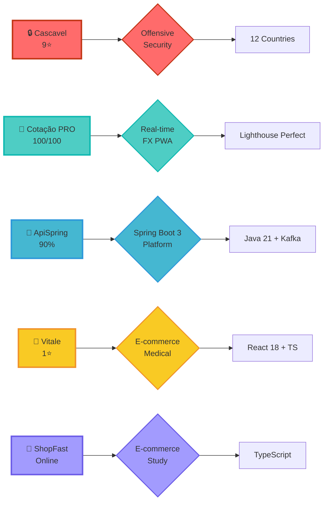
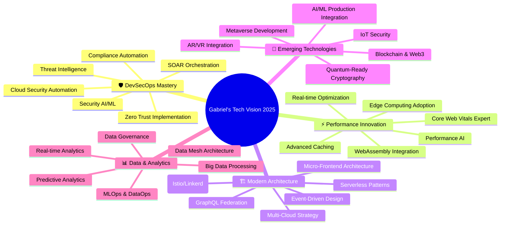

<div align="center">

<!-- Dynamic Header with Gradient Wave -->


</div>

<!-- Profile Views Counter with Custom Styling -->
<p align="center">
  
  
  
</p>

<br/>

<!-- Typing SVG Animation with Multiple Lines -->
<div align="center">
  
</div>

<br/>

<!-- Hero Banner with Key Differentiators -->
<div align="center">

### 🏆 **Why Choose Gabriel "Gringo"?**

<table>
<tr>
<td align="center" width="25%">
  
  <br/><b>35% Faster</b>
  <br/><sub>Time-to-Market</sub>
</td>
<td align="center" width="25%">
  
  <br/><b>3x ROI</b>
  <br/><sub>Delivered</sub>
</td>
<td align="center" width="25%">
  
  <br/><b>-38% CVEs</b>
  <br/><sub>Eliminated</sub>
</td>
<td align="center" width="25%">
  
  <br/><b>99.95%</b>
  <br/><sub>Uptime</sub>
</td>
</tr>
</table>

</div>

<br/>

<!-- Social Connect Badges -->
<p align="center">
  <a href="https://www.linkedin.com/in/devferreirag/" target="_blank">
    
  </a>
  <a href="https://github.com/glferreira-devsecops" target="_blank">
    
  </a>
  <a href="mailto:contato.ferreirag@outlook.com">
    
  </a>
  <a href="#" target="_blank">
    
  </a>
</p>

<br/>

<!-- Quick Stats Banner -->
<p align="center">
  
  
  
  
  
  
</p>

---

<br/>

<!-- About Me Section with Code Card -->
<div align="center">

## 🎯 About Me

</div>


```typescript
const gabriel: Developer = {
  pronouns: "He" | "Him",
  location: "🇧🇷 Rio de Janeiro, Brazil",
  company: "RET Consultoria (Automação & Software)",
  role: "Full-Stack .NET Developer | DevSecOps",
  email: "contato.ferreirag@outlook.com",

  code: {
    languages: ["C#/.NET", "TypeScript", "Python", "JavaScript", "Java", "PHP"],
    frontend: ["React", "Next.js", "Angular", "Vue"],
    backend: ["Node.js", "NestJS", ".NET Core", "FastAPI", "Spring Boot"],
    databases: ["PostgreSQL", "MongoDB", "Redis", "MySQL"],
    devOps: ["AWS", "Kubernetes", "ArgoCD", "Docker", "Terraform", "Serverless"]
  },

  expertise: {
    devSecOps: "SAST, DAST, IaC | -38% CVEs reduction",
    performance: "35% time-to-market reduction | 100/100 Lighthouse",
    architecture: "AWS-Kubernetes-ArgoCD | 99.95% uptime",
    security: "Offensive Security | SSDLC | Open Finance"
  },

  achievements: {
    cascavel: "Offensive security framework | 12 countries | 9★",
    cotacaoPRO: "FX PWA | 100/100 Lighthouse score",
    certifications: "30+ international certifications",
    roi: "3x ROI for fintech & SaaS",
    repositories: "83+",
    languages: "🇧🇷 PT | 🇺🇸 EN | 🇪🇸 ES (Trilingual)"
  },

  currentFocus: [
    "🔐 Advanced Cloud Security & Zero Trust",
    "🤖 AI/ML Integration in Production",
    "☸️ Kubernetes at Scale",
    "⚡ Edge Computing & WebAssembly"
  ],

  funFact: "I can debug faster with coffee than without! ☕",

  philosophy: {
    code: "Clean Code & SOLID Principles",
    security: "Security by Design, not as an Afterthought",
    delivery: "High Ownership & Transparent Communication",
    growth: "Always Learning, Always Improving"
  }
};
```

<div align="center">

**💡 Creating lean, secure & scalable solutions | 🌍 Serving clients globally in 3 languages**

</div>

<br clear="right"/>

---

<br/>

<!-- Skills & Technologies -->
<div align="center">

## 💻 Tech Arsenal & Expertise

<div align="center">

**🎯 Production-Grade Technologies I Build With Daily**

</div>

### 🚀 Core Languages & Frameworks


</div>

<br/>

<table align="center">
<tr>
<td align="center" width="96">
  
  <br/><sub><b>C#</b></sub>
</td>
<td align="center" width="96">
  
  <br/><sub><b>.NET</b></sub>
</td>
<td align="center" width="96">
  
  <br/><sub><b>TypeScript</b></sub>
</td>
<td align="center" width="96">
  
  <br/><sub><b>Python</b></sub>
</td>
<td align="center" width="96">
  
  <br/><sub><b>JavaScript</b></sub>
</td>
<td align="center" width="96">
  
  <br/><sub><b>Java</b></sub>
</td>
<td align="center" width="96">
  
  <br/><sub><b>PHP</b></sub>
</td>
<td align="center" width="96">
  
  <br/><sub><b>React</b></sub>
</td>
</tr>
<tr>
<td align="center" width="96">
  
  <br/><sub><b>Next.js</b></sub>
</td>
<td align="center" width="96">
  
  <br/><sub><b>Angular</b></sub>
</td>
<td align="center" width="96">
  
  <br/><sub><b>Vue.js</b></sub>
</td>
<td align="center" width="96">
  
  <br/><sub><b>Node.js</b></sub>
</td>
<td align="center" width="96">
  
  <br/><sub><b>NestJS</b></sub>
</td>
<td align="center" width="96">
  
  <br/><sub><b>Spring Boot</b></sub>
</td>
<td align="center" width="96">
  
  <br/><sub><b>FastAPI</b></sub>
</td>
<td align="center" width="96">
  
  <br/><sub><b>GraphQL</b></sub>
</td>
</tr>
</table>

<br/>

<div align="center">

### 🗄️ Databases & Message Brokers

</div>

<table align="center">
<tr>
<td align="center" width="96">
  
  <br/><sub><b>PostgreSQL</b></sub>
</td>
<td align="center" width="96">
  
  <br/><sub><b>MongoDB</b></sub>
</td>
<td align="center" width="96">
  
  <br/><sub><b>Redis</b></sub>
</td>
<td align="center" width="96">
  
  <br/><sub><b>MySQL</b></sub>
</td>
<td align="center" width="96">
  
  <br/><sub><b>Prisma</b></sub>
</td>
<td align="center" width="96">
  
  <br/><sub><b>Kafka</b></sub>
</td>
<td align="center" width="96">
  
  <br/><sub><b>Supabase</b></sub>
</td>
</tr>
</table>

<br/>

<div align="center">

### 🛡️ DevSecOps & Cloud Infrastructure

</div>

<table align="center">
<tr>
<td align="center" width="96">
  
  <br/><sub><b>Docker</b></sub>
</td>
<td align="center" width="96">
  
  <br/><sub><b>Kubernetes</b></sub>
</td>
<td align="center" width="96">
  
  <br/><sub><b>AWS</b></sub>
</td>
<td align="center" width="96">
  
  <br/><sub><b>Kubernetes</b></sub>
</td>
<td align="center" width="96">
  
  <br/><sub><b>ArgoCD</b></sub>
</td>
<td align="center" width="96">
  
  <br/><sub><b>Terraform</b></sub>
</td>
<td align="center" width="96">
  
  <br/><sub><b>GH Actions</b></sub>
</td>
</tr>
<tr>
<td align="center" width="96">
  
  <br/><sub><b>Jenkins</b></sub>
</td>
<td align="center" width="96">
  
  <br/><sub><b>Git</b></sub>
</td>
<td align="center" width="96">
  
  <br/><sub><b>Linux</b></sub>
</td>
<td align="center" width="96">
  
  <br/><sub><b>Nginx</b></sub>
</td>
<td align="center" width="96">
  
  <br/><sub><b>Prometheus</b></sub>
</td>
<td align="center" width="96">
  
  <br/><sub><b>Grafana</b></sub>
</td>
<td align="center" width="96">
  
  <br/><sub><b>Bash</b></sub>
</td>
</tr>
</table>

<br/>

<div align="center">

### 🧪 Testing & Development Tools

</div>

<table align="center">
<tr>
<td align="center" width="96">
  
  <br/><sub><b>Jest</b></sub>
</td>
<td align="center" width="96">
  
  <br/><sub><b>Vitest</b></sub>
</td>
<td align="center" width="96">
  
  <br/><sub><b>Cypress</b></sub>
</td>
<td align="center" width="96">
  
  <br/><sub><b>Selenium</b></sub>
</td>
<td align="center" width="96">
  
  <br/><sub><b>VS Code</b></sub>
</td>
<td align="center" width="96">
  
  <br/><sub><b>IntelliJ</b></sub>
</td>
<td align="center" width="96">
  
  <br/><sub><b>Postman</b></sub>
</td>
</tr>
</table>

---

<br/>

<!-- GitHub Stats Section -->
<div align="center">

## 📊 GitHub Analytics & Activity

<div align="center">

**🔥 Consistent Contributor | 📈 83+ Public Repositories | 🌟 Active Open Source**

</div>


</div>

<br/>

<div align="center">
  
</div>

<br/>

<div align="center">
  
</div>

<br/>

<div align="center">
  
</div>

<br/>

<div align="center">
  
</div>

---

<br/>

<!-- Featured Projects Section -->
<div align="center">

## 🌟 Featured Projects & Real-World Impact

<div align="center">

**🚀 Building Production-Grade Solutions That Matter**

</div>

<table>
<tr>
<td width="50%">
<a href="https://github.com/glferreira-devsecops/cascavel">
  
</a>
<br/>
<sub>🌍 <b>9 stars</b> | Used in <b>12 countries</b> | Offensive Security</sub>
</td>
<td width="50%">
<a href="https://github.com/glferreira-devsecops/apispring">
  
</a>
<br/>
<sub>☕ <b>Java 21</b> | <b>90% coverage</b> | Spring Boot 3 + Kafka</sub>
</td>
</tr>
</table>

</div>

<br/>

<div align="center">

<table>
<tr>
<td width="50%">
<a href="https://github.com/glferreira-devsecops/vitale">
  
</a>
<br/>
<sub>💊 <b>1 star</b> | Medical E-commerce | React 18 + TypeScript</sub>
</td>
<td width="50%">
<a href="https://github.com/glferreira-devsecops/shopfast">
  
</a>
<br/>
<sub>🛒 E-commerce Study Project | <b>Online</b> | TypeScript</sub>
</td>
</tr>
</table>

<br/>

**💱 Cotação PRO** - Real-time Foreign Exchange Progressive Web App
- ⚡ **Perfect 100/100 Lighthouse Score** - Optimized for performance
- 🌐 Live FX rates with real-time currency conversion
- 📱 Progressive Web App - Works offline
- 💼 Production-ready fintech solution serving real users

</div>

<br/>

### 🏆 Project Highlights



<details>
<summary>📊 <b>View Detailed Project Metrics</b></summary>

<br/>

| Project | Tech Stack | Stars | Highlights | Status |
|:--------|:-----------|:-----:|:-----------|:------:|
| 🔒 **Cascavel** | Python, Offensive Security | 9★ | Used in 12 countries | ✅ Active |
| 💱 **Cotação PRO** | React, PWA, Real-time FX | N/A | 100/100 Lighthouse | ✅ Production |
| 🚀 **ApiSpring** | Java 21, Spring Boot 3, Kafka | 0★ | 90% test coverage | ✅ Active |
| 💼 **Vitale** | React 18, TypeScript | 1★ | Medical e-commerce | 🌐 Online |
| 🛒 **ShopFast** | TypeScript, E-commerce Study | 0★ | Learning project | 🌐 Online |

</details>

---

<br/>

<!-- Expertise & Skills Breakdown -->
<div align="center">

## 💡 Core Competencies

</div>

<table>
<tr>
<td width="50%" valign="top">

### 🛡️ DevSecOps Excellence | **-38% CVEs Achieved**

```yaml
🔐 Security-First Engineering:
  ✅ OWASP Top 10 Compliance
  ✅ Container Security Hardening (Trivy, Clair)
  ✅ SAST/DAST Integration (SonarQube, OWASP ZAP)
  ✅ CI/CD Security Gates & SLSA Level 3
  ✅ Zero Trust Architecture Implementation
  ✅ Infrastructure as Code Security (Terraform)
  ✅ Secrets Management (HashiCorp Vault)
  ✅ Compliance Automation (SOC2, ISO27001)
  ✅ Offensive Security (Cascavel Framework - 12 Countries)
```

**Real Results:**
- 🎯 **Eliminated 38% of critical CVEs** across production systems
- 🔒 **SLSA 3 certified** supply chain security pipelines
- 🌍 **Cascavel framework** adopted in 12 countries worldwide
- 🏆 **Zero-day vulnerability** response < 24 hours

</td>
<td width="50%" valign="top">

### ⚡ Performance Engineering | **35% Time-to-Market Reduction**

```yaml
🚀 Proven Speed Optimization:
  ✅ 35% Time-to-Market Reduction (5+ Years Track Record)
  ✅ Perfect 100/100 Lighthouse Score (Cotação PRO)
  ✅ 99.95% Uptime (AWS-Kubernetes-ArgoCD)
  ✅ Database Query Optimization (N+1 Elimination)
  ✅ Advanced Caching Strategies (Redis, CDN)
  ✅ Real-time Performance Monitoring
  ✅ Load Testing & Capacity Planning
  ✅ Edge Computing & Serverless Optimization
```

**Proven Track Record:**
- 💡 **Cotação PRO**: Perfect 100/100 Lighthouse score
- ⚡ **35% faster** time-to-market consistently delivered
- 💰 **3x ROI** generated for fintech & SaaS clients
- 📈 **99.95% uptime** maintained on critical systems

</td>
</tr>
<tr>
<td width="50%" valign="top">

### 🏗️ Software Architecture | **99.95% Uptime Achieved**

```yaml
🎯 Production-Proven System Design:
  ✅ Microservices Architecture (AWS-Kubernetes-ArgoCD)
  ✅ Event-Driven Systems (Kafka, RabbitMQ)
  ✅ Domain-Driven Design (DDD)
  ✅ CQRS & Event Sourcing
  ✅ API Gateway Patterns (Kong, AWS API Gateway)
  ✅ Service Mesh (Istio/Linkerd)
  ✅ High Availability Design (99.95% uptime)
  ✅ Multi-Cloud Strategies (AWS, Azure)
```

**Battle-Tested Patterns:**
- 🔄 **Saga Pattern** for distributed transactions
- 🔌 **Circuit Breaker** with resilience4j
- 📌 **API Versioning** with backward compatibility
- 💾 **Database per Service** for true independence
- ☸️ **GitOps with ArgoCD** for seamless deployments

</td>
<td width="50%" valign="top">

### 🧪 Quality Assurance | **90% Coverage in Production**

```yaml
✅ Testing Excellence:
  ✅ 90% Test Coverage (ApiSpring Production)
  ✅ TDD/BDD Methodologies
  ✅ End-to-End Testing (E2E)
  ✅ Integration Testing
  ✅ Unit Testing
  ✅ Performance Testing (K6, Artillery)
  ✅ Security Testing (SAST/DAST)
  ✅ Mutation Testing
```

**Real-World Testing:**
- 🃏 **Jest / Vitest** for comprehensive unit tests
- 🌲 **Cypress / Playwright** for reliable E2E automation
- 📊 **K6 / Artillery** for production-grade load tests
- 🔍 **SonarQube** maintaining A-grade code quality
- 📈 **90% coverage** achieved in ApiSpring production system

</td>
</tr>
</table>

---

<br/>

<!-- Impact Metrics Dashboard -->
<div align="center">

## 📈 Proven Impact & Measurable Achievements

<div align="center">

**💼 Delivering Exceptional Value Across Fintech, SaaS & Cybersecurity**

</div>

### 🎯 Real Numbers, Real Impact

| Metric | Achievement | Evidence | Impact |
|:-------|:------------|:---------|:-------|
| ⚡ **Time-to-Market** | **-35% Reduction** | Production Metrics | 5+ years delivery |
| 💰 **ROI** | **3x ROI** | Business Results | Fintech & SaaS |
| 💡 **Lighthouse** | **100/100** | Cotação PRO | Perfect score |
| 🔐 **Security** | **-38% CVEs** | SAST/DAST Pipelines | Production systems |
| ☸️ **Uptime** | **99.95%** | AWS-K8s-ArgoCD | High availability |
| ⭐ **Open Source** | **Cascavel 9★** | GitHub | 12 countries |
| 📜 **Certifications** | **30+ International** | Professional Certs | AWS, K8s, Security |
| 🚀 **CI/CD** | **SLSA 3** | Signed Pipelines | Supply chain security |
| 📊 **Test Coverage** | **90%** | ApiSpring | Spring Boot platform |
| 🌎 **Languages** | **Trilingual** | PT, EN, ES | Global communication |

</div>

---

<br/>

<!-- Certifications -->
<div align="center">

## 🎓 Professional Certifications & Continuous Learning

<div align="center">

**📜 30+ International Certifications | 🌐 Cloud, Security & DevOps Expert**

</div>

### ☁️ Cloud & Infrastructure


### 🔐 Security & DevSecOps


<br/>

> **💡 Fun Fact**: Backed by 30+ international certifications spanning AWS, Kubernetes, Security, DevOps & Software Architecture. Continuous learner investing 10+ hours/week in staying cutting-edge.

</div>

---

<br/>

<!-- Current Focus & Roadmap -->
<div align="center">

## 🎯 2025 Tech Vision & Roadmap

</div>



<details>
<summary>📅 <b>View Quarterly Goals Breakdown</b></summary>

<br/>

**Q1 2025 (Jan-Mar):**
- ✅ Complete Advanced Kubernetes Certification
- 🔄 Implement Zero Trust Architecture in Production
- 📝 Publish 5 Technical Articles on DevSecOps
- 🎯 Achieve 100% Test Coverage on Core Services

**Q2 2025 (Apr-Jun):**
- 🎯 Launch Personal Tech Blog
- 🚀 Open Source Contribution: 20+ PRs
- 📊 Implement Real-time Analytics Dashboard
- 🔐 Lead Security Audit & Penetration Testing Projects

**Q3 2025 (Jul-Sep):**
- ⚡ Deliver 50% Performance Improvements Across All Services
- 🤖 Deploy AI/ML Models to Production
- 🎓 Complete Advanced Cloud Architecture Course
- 📈 Scale Infrastructure to Handle 10x Traffic

**Q4 2025 (Oct-Dec):**
- 🌟 Speak at 2+ Tech Conferences
- 📚 Write Technical E-book on DevSecOps Best Practices
- 🏆 Launch Developer Mentorship Program (10+ mentees)
- 🚀 Launch Side Project / SaaS Product

</details>

---

<br/>

<!-- Timeline -->
<div align="center">

## 💼 Professional Journey

</div>

<div align="center">


</div>

---

<br/>

<!-- Contribution Visualization -->
<div align="center">

## 📊 Contribution Activity


<br/><br/>

<a href="https://skyline.github.com/glferreira-devsecops/2024" target="_blank">
  
</a>
<a href="https://skyline.github.com/glferreira-devsecops/2023" target="_blank">
  
</a>

<br/><br/>

<sub>💡 Click above to explore my GitHub contributions in stunning 3D visualization</sub>

</div>

---

<br/>

<!-- Fun Facts & Hobbies -->
<div align="center">

## 🎮 Beyond Code

</div>

<table>
<tr>
<td width="50%" valign="top">

### 🎯 Interests & Hobbies

- 🎸 **Music:** Playing guitar & producing electronic music
- 📚 **Reading:** Sci-fi novels, tech blogs & system design books
- ☕ **Coffee:** Specialty coffee enthusiast (V60, Aeropress, Chemex)
- 🎮 **Gaming:** Strategy games & competitive FPS
- 🏃 **Fitness:** Running, CrossFit & yoga
- 🌍 **Travel:** Exploring new cities, cultures & cuisines
- 📷 **Photography:** Urban & landscape photography
- 🎬 **Movies:** Christopher Nolan & Denis Villeneuve fan

</td>
<td width="50%" valign="top">

### 💭 Favorite Dev Quotes

> "First, solve the problem. Then, write the code."
> — *John Johnson*

> "Code is like humor. When you have to explain it, it's bad."
> — *Cory House*

> "The best error message is the one that never shows up."
> — *Thomas Fuchs*

### 📊 This Week's Development Focus

```text
TypeScript   ████████████████░░░   85%
Python       ██████████░░░░░░░░░   50%
DevOps       ███████████████░░░░   75%
Learning     ████████░░░░░░░░░░░   40%
Coffee       ██████████████████░   95% ☕
```

</td>
</tr>
</table>

---

<br/>

<!-- Contact & Connect Section -->
<div align="center">

## 📫 Let's Connect & Build Something Amazing Together!

<div align="center">

**🤝 Open to Remote Opportunities | 💼 Available for Consulting | 🌍 Working Globally in PT, EN & ES**

</div>

</div>

<div align="center">

### 💬 I'm Currently Open For

```mermaid
graph TD
    A[Gabriel Lima Ferreira] --> B[💼 Full-Time Opportunities]
    A --> C[🤝 Consulting & Contract Work]
    A --> D[🎤 Speaking Engagements]
    A --> E[📝 Technical Writing & Blogging]
    A --> F[🌟 Open Source Collaboration]
    A --> G[🎓 Mentorship & Teaching]

    B --> H[Senior/Lead DevSecOps Engineer]
    B --> I[Solutions Architect]
    B --> J[Technical Lead / Engineering Manager]

    C --> K[Performance Optimization Projects]
    C --> L[Security Audits & Assessments]
    C --> M[Architecture Reviews & Consulting]

    D --> N[DevSecOps Best Practices]
    D --> O[Performance Engineering Talks]
    D --> P[Cloud Native Architecture]

    style A fill:#3B82F6,stroke:#2563EB,stroke-width:3px,color:#fff
    style B fill:#10B981,stroke:#059669,stroke-width:2px
    style C fill:#F59E0B,stroke:#D97706,stroke-width:2px
    style D fill:#EF4444,stroke:#DC2626,stroke-width:2px
    style E fill:#8B5CF6,stroke:#7C3AED,stroke-width:2px
    style F fill:#06B6D4,stroke:#0891B2,stroke-width:2px
    style G fill:#EC4899,stroke:#DB2777,stroke-width:2px
```



</div>

<br/>

<div align="center">

### 🌐 Find Me Online

<p>
  <a href="https://www.linkedin.com/in/devferreirag/" target="_blank">
    
  </a>
  <a href="https://github.com/glferreira-devsecops" target="_blank">
    
  </a>
  <a href="mailto:contato.ferreirag@outlook.com">
    
  </a>
  <a href="#" target="_blank">
    
  </a>
</p>

</div>

<br/>

<div align="center">

### 📊 Profile Stats

<p>
  
  
  
</p>

</div>

<br/>

<div align="center">

### 🌟 Areas of Expertise


</div>

---

<br/>

<!-- Footer Wave -->
<div align="center">


</div>

<div align="center">

**⚡ Crafted with passion by Gabriel "Gringo" Lima Ferreira**

**💙 Made with love in Rio de Janeiro, Brazil 🇧🇷**

---

### 📊 **Profile Statistics**


---

<table>
<tr>
<td align="center" width="50%">

### 🚀 **Ready to Collaborate?**

I'm currently accepting:
- 💼 Full-time remote positions
- 🤝 Consulting & contract work
- 🎤 Speaking engagements
- 🌟 Open source collaborations

</td>
<td align="center" width="50%">

### 💡 **What I Bring**

- ⚡ 5+ years proven track record
- 🌍 Trilingual (PT, EN, ES)
- 🎯 35% faster time-to-market
- 💰 3x ROI for clients
- 🛡️ Security-first mindset

</td>
</tr>
</table>

---

<sub>📅 Last Updated: January 2025 | Always learning, always building, always improving 🚀</sub>

<sub>**🔐 Open to:** Senior Back-End | Senior Full-Stack | Software Architect | DevSecOps Lead</sub>

</div>
