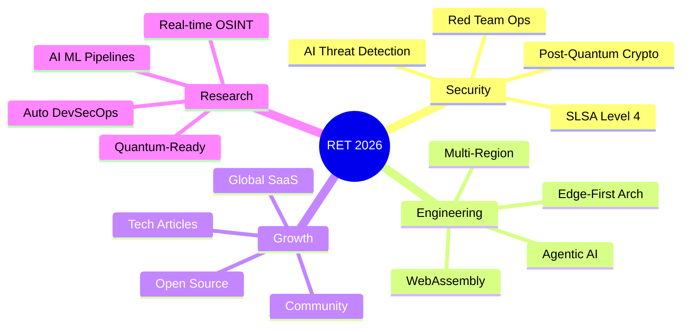

<div align="center">

# Gabriel "Gringo" Ferreira

### Founder & Engineering Director — [RET Tecnologia](https://www.rettecnologia.org)

**Engenharia de Software de Alta Performance & Cibersegurança Ofensiva**

[](https://www.rettecnologia.org)
[](https://www.linkedin.com/in/devferreirag/)
[](https://dev.to/rettecnologia)
[](https://wa.me/5521979364932)

</div>

---

```python
class GabrielFerreira:
    """Founder & Engineering Director @ RET Tecnologia"""

    role       = "Engineering Director"
    company    = "RET Tecnologia"
    location   = "Rio de Janeiro, Brasil"
    languages  = ["pt-BR", "en-US", "es"]
    experience = "5+ years"

    focus = [
        "Offensive Security & Red Team",
        "DevSecOps & Zero Trust Architecture",
        "High-Performance Web Engineering",
        "AI-Augmented Development (Agentic AI)",
    ]

    stats = {
        "ttm":        "-35% Time-to-Market",
        "roi":        "3x ROI comprovado",
        "cves":       "-38% CVEs em producao",
        "uptime":     "99.95% SLA",
        "lighthouse": "100/100 Perfect Score",
        "cascavel":   "12 paises, 500+ downloads",
        "certs":      "47 certificacoes verificadas",
        "articles":   "56 artigos tecnicos publicados",
    }
```

---

### O que a RET Tecnologia faz

> Construimos sistemas blindados, realizamos pentests e protegemos empresas contra ameacas digitais.

- **Sistemas Web** — Next.js, React, .NET, TypeScript
- **Ciberseguranca** — Pentest, OSINT, Red Team, Vulnerability Assessment
- **DevSecOps** — Kubernetes, ArgoCD, Zero Trust, SAST/DAST
- **Automacoes** — IA Generativa, WhatsApp API, Pix, Agentic AI
- **Cloud Native** — AWS, Azure, Serverless, Edge Computing

---

### Arsenal Tecnologico

<details>
<summary><b>Backend & Runtime</b></summary>
<br/>


</details>

<details>
<summary><b>Frontend & UI</b></summary>
<br/>


</details>

<details>
<summary><b>Cloud, DevOps & Infra</b></summary>
<br/>


</details>

<details>
<summary><b>Security & Offensive</b></summary>
<br/>


</details>

<details>
<summary><b>Data & Messaging</b></summary>
<br/>


</details>

<details>
<summary><b>Observabilidade & AI</b></summary>
<br/>


</details>

---

### Projetos em Destaque

> **[Cascavel — Offensive Security Framework](https://github.com/glferreira-devsecops/superpowers)**
> Framework de seguranca ofensiva adotado em **12 paises** por profissionais de pentest.
> `Python 3.11+` `OWASP Top 10` `Modular CLI` `500+ downloads`

> **[RET Tecnologia — Site Corporativo](https://www.rettecnologia.org)**
> Score **100/100 Lighthouse**, PWA nativo, SEO nuclear e DevSecOps pipeline completo.
> `Next.js 15` `TypeScript` `Vercel Edge` `CSP Strict`

> **[Cotacao PRO — Fintech PWA](https://github.com/glferreira-devsecops/Dolar)**
> PWA de cambio em tempo real com **100/100 Lighthouse** e First Paint < 0.8s.
> `React 18` `WebSocket` `Zustand` `PWA Offline-First`

> **[ApiSpring — Enterprise E-commerce](https://github.com/glferreira-devsecops/beckendcode)**
> Plataforma enterprise com **90% test coverage** e grade A no SonarQube.
> `Java 21` `Spring Boot 3` `Kafka` `CQRS` `PostgreSQL`

---

### GitHub Analytics

<div align="center">


</div>

<div align="center">


</div>

---

### Pilares de Excelencia

- **DevSecOps** — SAST/DAST, SLSA 3, Zero Trust, Supply Chain Security (-38% CVEs)
- **Performance** — 100/100 Lighthouse, Sub-100ms APIs, Edge Computing (35% faster TTM)
- **Arquitetura** — Microservices, Event-Driven, DDD, CQRS, Service Mesh (99.95% Uptime)
- **QA & Compliance** — 90%+ Test Coverage, SOC2, ISO 27001, LGPD, GDPR

---

### 47 Certificacoes Verificadas

<details>
<summary><b>AWS — 5 certificacoes</b></summary>
<br/>

| Certificacao | Credencial |
|:---|:---|
| AWS Cloud Solutions Architect | `KWEBG9F9F3YW` |
| Architecting Solutions on AWS | `MSJMGN0YB9PS` |
| AWS Cloud Technical Essentials | `YCDFKB0T3NMS` |
| AWS Educate Introduction to Cloud 101 | `48bf9edf` |
| AWS Educate Getting Started with Networking | `72bb0266` |

</details>

<details>
<summary><b>Google — 3 certificacoes</b></summary>
<br/>

| Certificacao | Credencial |
|:---|:---|
| Google Cybersecurity Professional | `ER2P9K9ZZPDT` |
| Foundations: Data, Data, Everywhere | `YHM0HU9K0ENQ` |
| Technical Support Fundamentals | `3OE7V38N5FPG` |

</details>

<details>
<summary><b>IBM — 7 certificacoes</b></summary>
<br/>

| Certificacao | Credencial |
|:---|:---|
| Fundamentals of Building AI Agents | `CR3EYME1GM84` |
| Build Multimodal Generative AI Apps | `CIORW059ZIKI` |
| Advanced RAG with Vector Databases | `8PQLML2TK0MY` |
| Vector Databases for RAG | `XVJNB12HELUZ` |
| Build RAG Applications: Get Started | `P6HZ9T2ZMD00` |
| Develop Generative AI Applications | `JFC7E8AX7ONO` |
| Containers, Kubernetes and OpenShift V2 | `f4fb1a8b` |

</details>

<details>
<summary><b>Datadog — 2 certificacoes</b></summary>
<br/>

| Certificacao | Credencial |
|:---|:---|
| Core Skills Learning Path | `24d4c942` |
| Backend Engineer Learning Path | `e7b64af7` |

</details>

<details>
<summary><b>Certiprof — 7 certificacoes</b></summary>
<br/>

| Certificacao | Credencial |
|:---|:---|
| Business Intelligence Foundation 2025 | `4f6894fd` |
| Design Sprint Learner 2025 | `80523f04` |
| Business Agility 2025 | `34807de8` |
| Scrum Foundation 2025 | `5c1dfd0f` |
| Prompt Engineering Foundation 2025 | `c026c9a4` |
| Cybersecurity Awareness 2025 | `1aa355f4` |
| Remote Work 2025 | `406dc379` |

</details>

<details>
<summary><b>freeCodeCamp — 11 certificacoes</b></summary>
<br/>

| Certificacao | Credencial |
|:---|:---|
| Legacy Back End | `devferreirag-lbe` |
| Legacy Front End | `devferreirag-lfe` |
| Legacy Data Visualization | `devferreirag-ldv` |
| Quality Assurance | `devferreirag-qa` |
| Scientific Computing with Python | `devferreirag-scwp` |
| Data Visualization | `devferreirag-dv` |
| Front End Development Libraries | `devferreirag-fedl` |
| JavaScript Algorithms and Data Structures | `devferreirag-jaads` |
| Responsive Web Design | `devferreirag-rwd` |
| Data Analysis with Python | `devferreirag-dawp` |
| Back End Development and APIs | `devferreirag-bedaa` |

</details>

<details>
<summary><b>HackerRank, Saylor, FGV e Outros — 12 certificacoes</b></summary>
<br/>

| Certificacao | Emissor | Credencial |
|:---|:---|:---|
| Certified Software Engineer | HackerRank | `efd8c98d3cfb` |
| CS205: Building with AI | Saylor | `8472278429GF` |
| CS260: Cryptography and Network Security | Saylor | `7510808637GF` |
| CS403: Modern Database Systems | Saylor | `8069241868GF` |
| Seguranca Digital (5h) | FGV | `14310708.20755` |
| FluencIA: IA Generativa | LinkedIn | `e96db41d` |
| Statistics 101 | CognitiveClass | `9c09f233` |
| College Algebra with Python | freeCodeCamp | `devferreirag-cawp` |
| Fundamentals of Building AI Agents | Coursera | `abcb4510` |
| AWS Educate Intro to Generative AI | AWS | `dcc137e0` |
| Lifelong Learning 2025 | Certiprof | `37b46b1c` |
| Istio and IBM Cloud Kubernetes | IBM | `4c70aa23` |

</details>

---

### Artigos Recentes — [Dev.to/rettecnologia](https://dev.to/rettecnologia)

- [OSINT: Sua Empresa Esta Nua na Internet e Voce Nem Sabe](https://dev.to/rettecnologia)
- [Zero Trust: Como Implementar Seguranca Real em 2026](https://dev.to/rettecnologia)
- [Edge Computing em 2026: Latencia Transformada em Lucro](https://dev.to/rettecnologia)
- [Arquitetura Agentica: IA Autonoma em Producao](https://dev.to/rettecnologia)
- [DevSecOps Shift-Left: 87% das Empresas Vao Sofrer Ataques em 2026](https://dev.to/rettecnologia)

> **[Ver todos os 56 artigos](https://dev.to/rettecnologia)**

---

### Visao 2026



---

<div align="center">

**A RET Tecnologia nao vende codigo — vende blindagem.**

[](https://www.rettecnologia.org/#contact)
[](https://wa.me/5521979364932)
[](https://dev.to/rettecnologia)

`PT-BR` `EN-US` `ES` — Rio de Janeiro, Brasil — GMT-3

*"Security by Design, not as an afterthought."*

</div>
