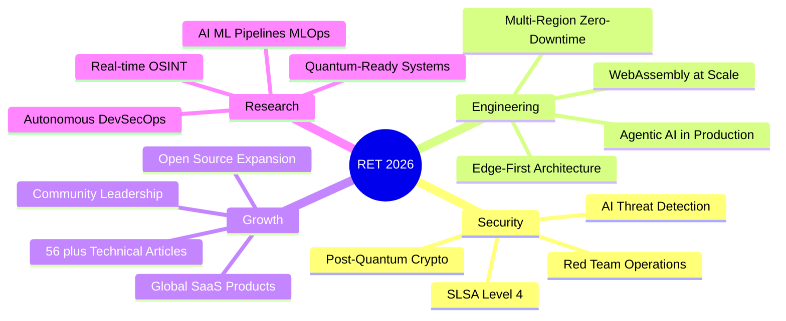

<div align="center">

<a href="https://www.rettecnologia.org">

</a>

<br/>

[](https://www.rettecnologia.org)
[](https://www.linkedin.com/in/devferreirag/)
[](https://dev.to/rettecnologia)
[](mailto:contato@rettecnologia.org)

</div>

---

<table>
<tr>
<td width="55%" valign="top">

### `$ whoami`

```python
class GabrielFerreira:
    role       = "Founder & Engineering Director"
    company    = "RET Tecnologia"
    location   = "Rio de Janeiro, Brasil 🇧🇷"
    languages  = ["pt-BR", "en-US", "es"]

    focus = [
        "Offensive Security & Red Team",
        "DevSecOps & Zero Trust Architecture",
        "High-Performance Web Engineering",
        "AI-Augmented Development (Agentic)",
    ]

    philosophy = "Security by Design, not as an afterthought."
```

</td>
<td width="45%" valign="top">

### 📊 Métricas de Impacto

| Métrica | Resultado |
|:---|:---|
| ⚡ Time-to-Market | **-35% TTM** |
| 💰 ROI Comprovado | **3× para clientes** |
| 🛡️ CVEs Eliminados | **-38% em produção** |
| 🖥️ Uptime SLA | **99.95%** |
| 🏆 Lighthouse | **100/100** |
| 🌍 Cascavel Framework | **12 países** |
| 📜 Certificações | **47 verificadas** |
| ✍️ Artigos Técnicos | **56 publicados** |

</td>
</tr>
</table>

---

### 🛡️ O que a RET Tecnologia faz

> **Engenharia de software de alta performance e cibersegurança ofensiva.**
> Construímos sistemas blindados, realizamos pentests e protegemos empresas contra ameaças digitais.

<table>
<tr>
<td align="center" width="20%">

🌐 **Sistemas Web**

Next.js · React · .NET

</td>
<td align="center" width="20%">

🔒 **Cibersegurança**

Pentest · OSINT · Red Team

</td>
<td align="center" width="20%">

☸️ **DevSecOps**

K8s · ArgoCD · Zero Trust

</td>
<td align="center" width="20%">

🤖 **Automações**

IA · WhatsApp · Pix

</td>
<td align="center" width="20%">

☁️ **Cloud Native**

AWS · Azure · Serverless

</td>
</tr>
</table>

---

### 🔧 Arsenal Tecnológico

<details>
<summary><b>⚙️ Backend & Runtime</b></summary>
<br/>


</details>

<details>
<summary><b>🎨 Frontend & UI</b></summary>
<br/>


</details>

<details>
<summary><b>☁️ Cloud, DevOps & Infra</b></summary>
<br/>


</details>

<details>
<summary><b>🛡️ Security & Offensive</b></summary>
<br/>


</details>

<details>
<summary><b>🗄️ Data & Messaging</b></summary>
<br/>


</details>

<details>
<summary><b>📡 Observabilidade & AI</b></summary>
<br/>


</details>

---

### 🌟 Projetos em Destaque

<table>
<tr>
<td width="50%">

**[🔒 Cascavel — Offensive Security Framework](https://github.com/glferreira-devsecops/superpowers)**

Framework de segurança ofensiva adotado em **12 países** por profissionais de pentest.

`Python 3.11+` `OWASP Top 10` `Modular CLI` `500+ downloads`

</td>
<td width="50%">

**[🌐 RET Tecnologia — Site Corporativo](https://www.rettecnologia.org)**

Site com score **100/100 Lighthouse**, PWA nativo, SEO nuclear e DevSecOps pipeline.

`Next.js 15` `TypeScript` `Vercel Edge` `CSP Strict`

</td>
</tr>
<tr>
<td width="50%">

**[💱 Cotação PRO — Fintech PWA](https://github.com/glferreira-devsecops/Dolar)**

PWA de câmbio em tempo real com **100/100 Lighthouse** e < 0.8s First Paint.

`React 18` `WebSocket` `Zustand` `PWA Offline-First`

</td>
<td width="50%">

**[🚀 Casa dos Lobos — Web Platform](https://github.com/glferreira-devsecops/Casadoslobos)**

Plataforma web completa com design premium e arquitetura moderna.

`TypeScript` `React` `Node.js` `Full-Stack`

</td>
</tr>
</table>

---

### 📊 GitHub Analytics

<div align="center">

<a href="https://github.com/glferreira-devsecops">
  
</a>
<a href="https://github.com/glferreira-devsecops">
  
</a>

<br/>

<a href="https://github.com/glferreira-devsecops">
  
</a>

</div>

---

### 🏛️ Pilares de Excelência

<table>
<tr>
<td width="25%" align="center">

**🛡️ DevSecOps**

SAST/DAST · SLSA 3 · Zero Trust

Supply Chain Security

-38% CVEs em produção

</td>
<td width="25%" align="center">

**⚡ Performance**

100/100 Lighthouse · Sub-100ms APIs

Edge Computing · CDN Multi-Tier

35% faster TTM

</td>
<td width="25%" align="center">

**🏗️ Arquitetura**

Microservices · Event-Driven

DDD · CQRS · Service Mesh

99.95% Uptime SLA

</td>
<td width="25%" align="center">

**🧪 QA & Compliance**

90%+ Test Coverage · SOC2

ISO 27001 · LGPD · GDPR

Pipeline 100% automatizado

</td>
</tr>
</table>

---

### 📜 47 Certificações Verificadas

<details>
<summary><b>☁️ Amazon Web Services (AWS) — 5 certificações</b></summary>
<br/>

| Certificação | Credential ID |
|:---|:---|
| AWS Cloud Solutions Architect | `KWEBG9F9F3YW` |
| Architecting Solutions on AWS | `MSJMGN0YB9PS` |
| AWS Cloud Technical Essentials | `YCDFKB0T3NMS` |
| AWS Educate Introduction to Cloud 101 | `48bf9edf-1341` |
| AWS Educate Getting Started with Networking | `72bb0266-938a` |

</details>

<details>
<summary><b>🔵 Google — 3 certificações</b></summary>
<br/>

| Certificação | Credential ID |
|:---|:---|
| Google Cybersecurity Professional Certificate | `ER2P9K9ZZPDT` |
| Foundations: Data, Data, Everywhere | `YHM0HU9K0ENQ` |
| Technical Support Fundamentals | `3OE7V38N5FPG` |

</details>

<details>
<summary><b>🔷 IBM — 7 certificações</b></summary>
<br/>

| Certificação | Credential ID |
|:---|:---|
| Fundamentals of Building AI Agents | `CR3EYME1GM84` |
| Build Multimodal Generative AI Applications | `CIORW059ZIKI` |
| Advanced RAG with Vector Databases | `8PQLML2TK0MY` |
| Vector Databases for RAG | `XVJNB12HELUZ` |
| Build RAG Applications: Get Started | `P6HZ9T2ZMD00` |
| Develop Generative AI Applications | `JFC7E8AX7ONO` |
| Introduction to Containers, Kubernetes & OpenShift V2 | `f4fb1a8b` |

</details>

<details>
<summary><b>🟣 Datadog — 2 certificações</b></summary>
<br/>

| Certificação | Credential ID |
|:---|:---|
| Core Skills Learning Path | `24d4c942-3ed3` |
| Backend Engineer Learning Path | `e7b64af7-d795` |

</details>

<details>
<summary><b>🟢 Certiprof — 7 certificações</b></summary>
<br/>

| Certificação | Credential ID |
|:---|:---|
| Business Intelligence Foundation 2025 | `4f6894fd-b732` |
| Design Sprint Learner 2025 | `80523f04-7c0d` |
| Business Agility 2025 | `34807de8-2a99` |
| Scrum Foundation 2025 | `5c1dfd0f-d26c` |
| Prompt Engineering Foundation 2025 | `c026c9a4-a9a7` |
| Cybersecurity Awareness 2025 | `1aa355f4-daec` |
| Remote Work 2025 | `406dc379-8700` |

</details>

<details>
<summary><b>🔴 freeCodeCamp — 11 certificações</b></summary>
<br/>

| Certificação | Credential ID |
|:---|:---|
| Legacy Back End | `devferreirag-lbe` |
| Legacy Front End | `devferreirag-lfe` |
| Legacy Data Visualization | `devferreirag-ldv` |
| Quality Assurance | `devferreirag-qa` |
| Scientific Computing with Python | `devferreirag-scwp` |
| Data Visualization | `devferreirag-dv` |
| Front End Development Libraries | `devferreirag-fedl` |
| JavaScript Algorithms & Data Structures | `devferreirag-jaads` |
| Responsive Web Design | `devferreirag-rwd` |
| Data Analysis with Python | `devferreirag-dawp` |
| Back End Development and APIs | `devferreirag-bedaa` |

</details>

<details>
<summary><b>🎓 Saylor University, HackerRank, FGV & Outros — 12 certificações</b></summary>
<br/>

| Certificação | Emissor | Credential ID |
|:---|:---|:---|
| HackerRank Certified Software Engineer | HackerRank | `efd8c98d3cfb` |
| CS205: Building with AI | Saylor University | `8472278429GF` |
| CS260: Intro to Cryptography & Network Security | Saylor University | `7510808637GF` |
| CS403: Intro to Modern Database Systems | Saylor University | `8069241868GF` |
| Segurança Digital (5h) | FGV | `14310708.20755` |
| FluêncIA: IA Generativa | LinkedIn | `e96db41d` |
| Statistics 101 | CognitiveClass | `9c09f233` |
| College Algebra with Python | freeCodeCamp | `devferreirag-cawp` |
| Fundamentals of Building AI Agents | Coursera | `abcb4510-b504` |
| AWS Educate Intro to Generative AI | AWS | `dcc137e0-ad9a` |
| Lifelong Learning 2025 | Certiprof | `37b46b1c-fd91` |
| Beyond the Basics: Istio & IBM Cloud K8s | IBM | `4c70aa23b001` |

</details>

---

### ✍️ Artigos Recentes no Dev.to

<!-- BLOG-POST-LIST:START -->
- 🔐 [OSINT: Sua Empresa Está Nua na Internet e Você Nem Sabe](https://dev.to/rettecnologia)
- 🛡️ [Zero Trust Não É Buzzword: Como Implementar Segurança Real em 2026](https://dev.to/rettecnologia)
- ⚡ [Edge Computing em 2026: A Arquitetura Que Transformou Latência em Lucro](https://dev.to/rettecnologia)
- 🤖 [Arquitetura Agêntica: Como Colocar IA Autônoma em Produção](https://dev.to/rettecnologia)
- 🔒 [DevSecOps Shift-Left: Por Que 87% das Empresas Vão Sofrer Ataques em 2026](https://dev.to/rettecnologia)
<!-- BLOG-POST-LIST:END -->

> **[📚 Todos os 56 artigos →](https://dev.to/rettecnologia)**

---

### 🎯 Visão 2026



---

<div align="center">

### 🤝 Vamos construir algo inquebrável?

**A RET Tecnologia não vende código — vende blindagem.**

[](https://www.rettecnologia.org/#contact)
[](https://wa.me/5521979364932)
[](https://dev.to/rettecnologia)

---

`🌍 PT-BR · EN-US · ES` · `📍 Rio de Janeiro, Brasil` · `⏰ GMT-3 (BRT)`

**"Security by Design, not as an afterthought."**


</div>
