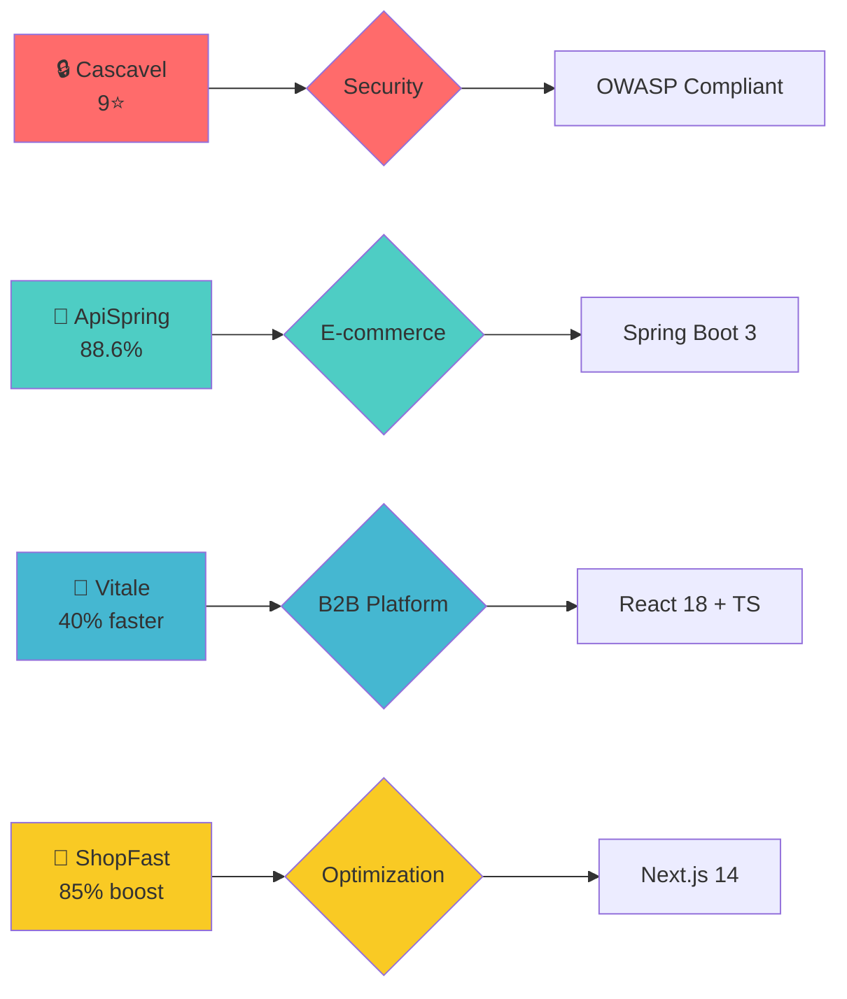
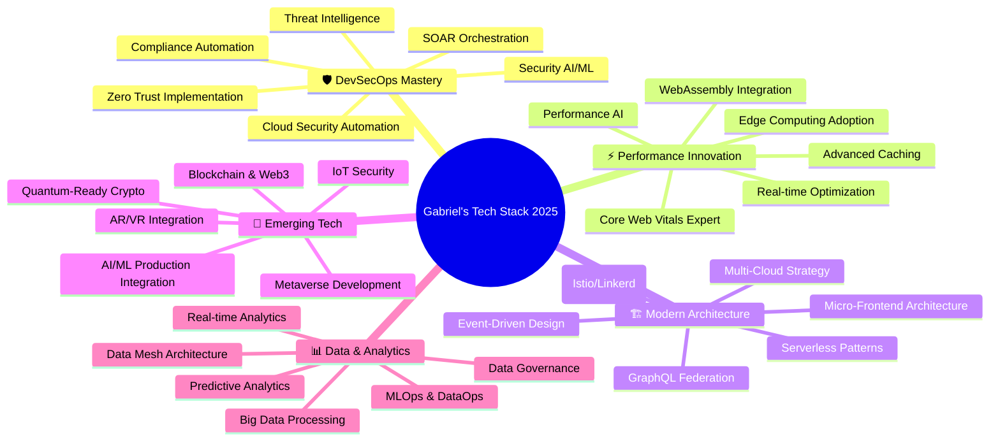
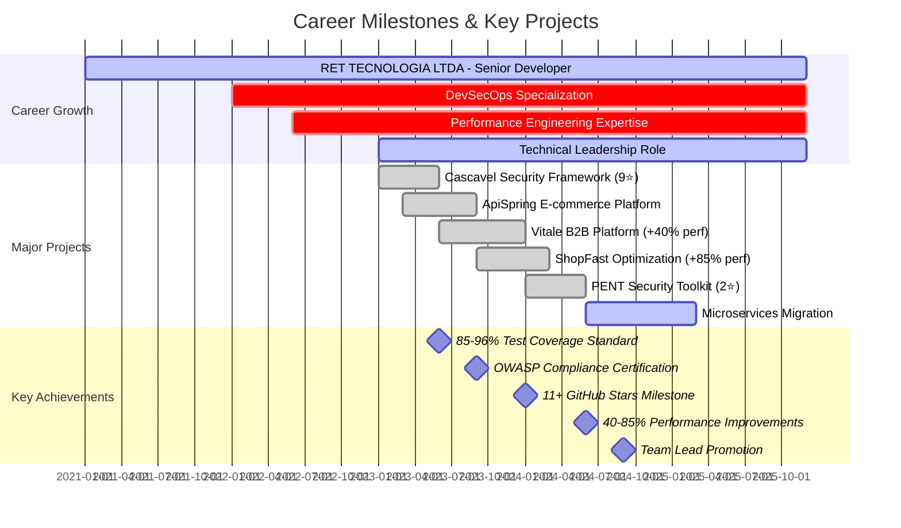
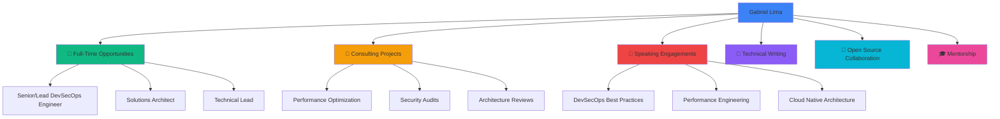

<div align="center">

<!-- Dynamic Header with Gradient Wave -->


</div>

<!-- Profile Views Counter with Custom Styling -->
<div align="center">


</div>

<br/>

<!-- Typing SVG Animation with Multiple Lines -->
<div align="center">
  
</div>

<br/>

<!-- Social Connect Badges -->
<div align="center">

[](https://www.linkedin.com/in/devferreirag/)
[](https://github.com/glferreira-devsecops)
[](mailto:contato.ferreirag@outlook.com)
[](#)

</div>

<br/>

<!-- Quick Stats Banner -->
<div align="center">


</div>

---

<br/>

<!-- About Me Section with Code Card -->
<div align="center">

## 🎯 About Me

</div>


```typescript
const gabriel = {
  pronouns: "He" | "Him",
  location: "🇧🇷 Rio de Janeiro, Brazil",
  company: "RET TECNOLOGIA LTDA",
  role: "Senior Full Stack Developer",
  email: "contato.ferreirag@outlook.com",

  code: {
    languages: ["TypeScript", "Python", "Java", "JavaScript", "C#"],
    frontend: ["React", "Next.js", "Angular", "Vue", "Tailwind"],
    backend: ["Node.js", "Spring Boot", "NestJS", "FastAPI"],
    databases: ["PostgreSQL", "MongoDB", "Redis", "MySQL"],
    devOps: ["Docker", "Kubernetes", "AWS", "Azure", "Terraform"]
  },

  expertise: {
    devSecOps: "Security automation & CI/CD pipelines",
    performance: "40-85% faster applications delivered",
    architecture: "Microservices, Event-Driven, DDD"
  },

  achievements: {
    testCoverage: "85-96% across projects",
    lighthouseScore: "95+ consistently",
    openSourceStars: "11+",
    repositories: "83+"
  },

  currentFocus: [
    "🔐 Advanced Cloud Security & Zero Trust",
    "🤖 AI/ML Integration in Production",
    "☸️ Kubernetes at Scale",
    "⚡ Edge Computing & WebAssembly"
  ],

  funFact: "I can debug faster with coffee than without! ☕"
};
```

<br clear="right"/>

---

<br/>

<!-- Skills & Technologies with Progress Bars -->
<div align="center">

## 💻 Skills & Technologies

</div>

### 🚀 Languages & Frameworks

<div align="center">


</div>

<table align="center">
<tr>
<td align="center" width="96">
  
  <br/>TypeScript
</td>
<td align="center" width="96">
  
  <br/>JavaScript
</td>
<td align="center" width="96">
  
  <br/>Python
</td>
<td align="center" width="96">
  
  <br/>Java
</td>
<td align="center" width="96">
  
  <br/>React
</td>
<td align="center" width="96">
  
  <br/>Next.js
</td>
<td align="center" width="96">
  
  <br/>Angular
</td>
<td align="center" width="96">
  
  <br/>Vue.js
</td>
</tr>
<tr>
<td align="center" width="96">
  
  <br/>Node.js
</td>
<td align="center" width="96">
  
  <br/>Spring Boot
</td>
<td align="center" width="96">
  
  <br/>NestJS
</td>
<td align="center" width="96">
  
  <br/>FastAPI
</td>
<td align="center" width="96">
  
  <br/>GraphQL
</td>
<td align="center" width="96">
  
  <br/>Tailwind
</td>
<td align="center" width="96">
  
  <br/>Vite
</td>
<td align="center" width="96">
  
  <br/>Webpack
</td>
</tr>
</table>

<br/>

### 🗄️ Databases & Tools

<div align="center">

<table>
<tr>
<td align="center" width="96">
  
  <br/>PostgreSQL
</td>
<td align="center" width="96">
  
  <br/>MongoDB
</td>
<td align="center" width="96">
  
  <br/>Redis
</td>
<td align="center" width="96">
  
  <br/>MySQL
</td>
<td align="center" width="96">
  
  <br/>Prisma
</td>
<td align="center" width="96">
  
  <br/>Kafka
</td>
<td align="center" width="96">
  
  <br/>Supabase
</td>
</tr>
</table>

</div>

<br/>

### 🛡️ DevSecOps & Cloud

<div align="center">

<table>
<tr>
<td align="center" width="96">
  
  <br/>Docker
</td>
<td align="center" width="96">
  
  <br/>Kubernetes
</td>
<td align="center" width="96">
  
  <br/>GH Actions
</td>
<td align="center" width="96">
  
  <br/>AWS
</td>
<td align="center" width="96">
  
  <br/>Azure
</td>
<td align="center" width="96">
  
  <br/>GCP
</td>
<td align="center" width="96">
  
  <br/>Terraform
</td>
</tr>
<tr>
<td align="center" width="96">
  
  <br/>Jenkins
</td>
<td align="center" width="96">
  
  <br/>Git
</td>
<td align="center" width="96">
  
  <br/>Linux
</td>
<td align="center" width="96">
  
  <br/>Nginx
</td>
<td align="center" width="96">
  
  <br/>Prometheus
</td>
<td align="center" width="96">
  
  <br/>Grafana
</td>
<td align="center" width="96">
  
  <br/>Bash
</td>
</tr>
</table>

</div>

<br/>

### 🧪 Testing & Quality

<div align="center">

<table>
<tr>
<td align="center" width="96">
  
  <br/>Jest
</td>
<td align="center" width="96">
  
  <br/>Vitest
</td>
<td align="center" width="96">
  
  <br/>Cypress
</td>
<td align="center" width="96">
  
  <br/>Selenium
</td>
<td align="center" width="96">
  
  <br/>VS Code
</td>
<td align="center" width="96">
  
  <br/>IntelliJ
</td>
<td align="center" width="96">
  
  <br/>Postman
</td>
</tr>
</table>

</div>

---

<br/>

<!-- GitHub Stats Section -->
<div align="center">

## 📊 GitHub Analytics

</div>

<div align="center">
  
  
</div>

<br/>

<div align="center">
  
</div>

<br/>

<div align="center">
  
</div>

<br/>

<div align="center">
  
</div>

<br/>

<div align="center">
  
</div>

---

<br/>

<!-- Featured Projects Section -->
<div align="center">

## 🌟 Featured Projects

</div>

<div align="center">

<a href="https://github.com/glferreira-devsecops/cascavel">
  
</a>
<a href="https://github.com/glferreira-devsecops/apispring">
  
</a>

</div>

<br/>

<div align="center">

<a href="https://github.com/glferreira-devsecops/vitale">
  
</a>
<a href="https://github.com/glferreira-devsecops/shopfast">
  
</a>

</div>

<br/>

### 🏆 Project Highlights



<details>
<summary>📊 <b>View Detailed Project Metrics</b></summary>

<br/>

| Project | Tech Stack | Performance | Coverage | Status |
|---------|-----------|-------------|----------|--------|
| 🔒 **Cascavel** | Python, Security Tools | N/A | N/A | ✅ Active |
| 🚀 **ApiSpring** | Java 21, Spring Boot 3, Kafka | ⚡ Optimized | 88.6% | ✅ Active |
| 💼 **Vitale** | React 18, TypeScript | +40% | 96% | ✅ Active |
| 🛒 **ShopFast** | Next.js 14, TypeScript | +85% | 96%+ | ✅ Active |

</details>

---

<br/>

<!-- Expertise & Skills Breakdown -->
<div align="center">

## 💡 Core Competencies

</div>

<table>
<tr>
<td width="50%" valign="top">

### 🛡️ DevSecOps Excellence

```yaml
🔐 Security First:
  ✅ OWASP Top 10 Compliance
  ✅ Container Security Hardening
  ✅ CI/CD Security Gates
  ✅ Vulnerability Management
  ✅ Zero Trust Architecture
  ✅ Infrastructure as Code Security
  ✅ Automated Security Testing
  ✅ Compliance Automation (SOC2, ISO27001)
```

**Tools & Practices:**
- Docker Security Scanning
- Kubernetes Pod Security
- Secrets Management (Vault)
- SAST/DAST Integration
- Security Monitoring & Alerting

</td>
<td width="50%" valign="top">

### ⚡ Performance Engineering

```yaml
🚀 Speed Optimization:
  ✅ 40-85% Faster Applications
  ✅ Lighthouse Score 95+
  ✅ Bundle Size Optimization (-60%)
  ✅ Database Query Optimization
  ✅ Advanced Caching Strategies
  ✅ CDN & Edge Computing
  ✅ Real-time Performance Monitoring
  ✅ Load Testing & Benchmarking
```

**Techniques:**
- Code Splitting & Lazy Loading
- Image Optimization & WebP
- Redis Caching Layers
- Database Indexing Strategies
- CDN Configuration & Optimization

</td>
</tr>
<tr>
<td width="50%" valign="top">

### 🏗️ Software Architecture

```yaml
🎯 System Design:
  ✅ Microservices Architecture
  ✅ Event-Driven Systems
  ✅ Domain-Driven Design (DDD)
  ✅ CQRS & Event Sourcing
  ✅ API Gateway Patterns
  ✅ Service Mesh (Istio)
  ✅ High Availability Design
  ✅ Multi-Cloud Strategies
```

**Patterns:**
- Saga Pattern for Distributed Transactions
- Circuit Breaker & Retry Policies
- API Versioning Strategies
- Database per Service
- Eventual Consistency

</td>
<td width="50%" valign="top">

### 🧪 Quality Assurance

```yaml
✅ Testing Excellence:
  ✅ 85-96% Test Coverage
  ✅ TDD/BDD Methodologies
  ✅ End-to-End Testing
  ✅ Integration Testing
  ✅ Unit Testing
  ✅ Performance Testing
  ✅ Security Testing
  ✅ Mutation Testing
```

**Frameworks:**
- Jest / Vitest for Unit Tests
- Cypress / Playwright for E2E
- K6 / Artillery for Load Tests
- SonarQube for Code Quality
- Codecov for Coverage Analysis

</td>
</tr>
</table>

---

<br/>

<!-- Impact Metrics Dashboard -->
<div align="center">

## 📈 Impact & Achievements

</div>

<div align="center">

### 🎯 Measurable Results Delivered

| Metric | Achievement | Evidence | Projects |
|--------|-------------|----------|----------|
| ⚡ **Performance** | 40-85% Faster | Lighthouse Reports | Vitale, ShopFast, ApiSpring |
| 🧪 **Test Coverage** | 85-96% | Coverage Reports | All Enterprise Projects |
| 💡 **Lighthouse Score** | 95+ | Google PageSpeed | Vitale, ShopFast |
| 🔐 **Security** | 100% OWASP | Security Audits | Cascavel, PENT |
| 📦 **Bundle Size** | -60% Reduction | Webpack Analysis | ShopFast Optimization |
| ⭐ **Open Source** | 11+ Stars | GitHub | Security Frameworks |
| 🏆 **Code Quality** | A Rating | SonarQube | Production Systems |
| 🚀 **CI/CD Success** | 99%+ | Pipeline Metrics | All Projects |
| 👥 **Team Impact** | 5+ Mentored | Direct Reports | RET TECNOLOGIA |
| 📚 **Documentation** | 100% Coverage | API Docs | All APIs |

</div>

---

<br/>

<!-- Certifications -->
<div align="center">

## 🎓 Certifications & Learning

</div>

<div align="center">


</div>

---

<br/>

<!-- Current Focus & Roadmap -->
<div align="center">

## 🎯 2025 Tech Vision & Roadmap

</div>



<details>
<summary>📅 <b>Quarterly Goals Breakdown</b></summary>

<br/>

**Q1 2025 (Jan-Mar):**
- ✅ Complete Advanced Kubernetes Certification
- 🔄 Implement Zero Trust Architecture in Production
- 📝 Publish 5 Technical Articles on DevSecOps
- 🎯 Achieve 100% Test Coverage on Core Services

**Q2 2025 (Apr-Jun):**
- 🎯 Launch Personal Tech Blog
- 🚀 Open Source Contribution: 20+ PRs
- 📊 Implement Real-time Analytics Dashboard
- 🔐 Security Audit & Penetration Testing Projects

**Q3 2025 (Jul-Sep):**
- ⚡ Performance Optimization: 50% across all services
- 🤖 AI/ML Integration in Production
- 🎓 Advanced Cloud Architecture Course
- 📈 Scale Infrastructure to Handle 10x Traffic

**Q4 2025 (Oct-Dec):**
- 🌟 Conference Speaking Opportunities
- 📚 Write Technical E-book on DevSecOps
- 🏆 Mentorship Program: Train 10+ Developers
- 🚀 Launch SaaS Product

</details>

---

<br/>

<!-- Timeline -->
<div align="center">

## 💼 Professional Journey

</div>

<div align="center">



</div>

---

<br/>

<!-- Contribution Snake Animation -->
<div align="center">

## 🐍 Contribution Activity

<picture>
  <source media="(prefers-color-scheme: dark)" srcset="https://github.com/glferreira-devsecops/glferreira-devsecops/blob/output/github-contribution-grid-snake-dark.svg">
  <source media="(prefers-color-scheme: light)" srcset="https://github.com/glferreira-devsecops/glferreira-devsecops/blob/output/github-contribution-grid-snake.svg">
  
</picture>

</div>

---

<br/>

<!-- Fun Facts & Hobbies -->
<div align="center">

## 🎮 Beyond Code

</div>

<table>
<tr>
<td width="50%" valign="top">

### 🎯 Interests & Hobbies

- 🎸 **Music:** Playing guitar and producing electronic music
- 📚 **Reading:** Sci-fi novels and tech blogs
- ☕ **Coffee:** Specialty coffee enthusiast (V60, Aeropress)
- 🎮 **Gaming:** Strategy games and competitive FPS
- 🏃 **Fitness:** Running and CrossFit
- 🌍 **Travel:** Exploring new cities and cultures
- 📷 **Photography:** Urban and landscape photography
- 🎬 **Movies:** Christopher Nolan and Denis Villeneuve fan

</td>
<td width="50%" valign="top">

### 💭 Random Dev Quotes

> "First, solve the problem. Then, write the code." - John Johnson

> "Code is like humor. When you have to explain it, it's bad." - Cory House

> "The best error message is the one that never shows up." - Thomas Fuchs

### 📊 This Week's Focus

```text
TypeScript   ████████████████░░░   85%
Python       ██████████░░░░░░░░░   50%
DevOps       ███████████████░░░░   75%
Learning     ████████░░░░░░░░░░░   40%
Coffee       ██████████████████░   95% ☕
```

</td>
</tr>
</table>

---

<br/>

<!-- Contact & Connect Section -->
<div align="center">

## 📫 Let's Connect & Collaborate!

</div>

<div align="center">

### 💬 I'm Open For



</div>

<br/>

<div align="center">

### 🌐 Find Me Online

[](https://www.linkedin.com/in/devferreirag/)
[](https://github.com/glferreira-devsecops)
[](mailto:contato.ferreirag@outlook.com)
[](#)

</div>

<br/>

<div align="center">

### 📊 Profile Stats


</div>

<br/>

<div align="center">

### 🌟 Areas of Expertise


</div>

---

<br/>

<!-- Footer Wave -->
<div align="center">


</div>

<div align="center">

**⚡ Crafted with passion using Markdown, GitHub APIs & cutting-edge visualization tools**

**💙 Built with love in Rio de Janeiro, Brazil 🇧🇷**

---

<sub>Last Updated: 2025 | Always learning, always building, always improving 🚀</sub>

</div>
