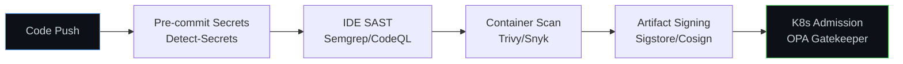

<h1 align="center">Gabriel "DevFerreiraG" Ferreira</h1>
<h3 align="center">Founder & Engineering Director @ RET Tecnologia</h3>

 

 

**"A RET Tecnologia não vende código — vende blindagem."**

[-58a6ff?style=for-the-badge)](https://www.rettecnologia.org/#contact)

---

### 🚀 Who I Am
**I don't just write code; I build digital fortresses.** 

My foundation was forged in mission-critical environments. Serving as an IT Assistant & Developer for the **Marinha do Brasil (Brazilian Navy)**, I internalized military-grade discipline regarding infrastructure, automation, and continuous monitoring. In such environments, there is no room for error, and security is not an afterthought—it is the baseline.

Today, as the Founder and DevSecOps Engineer of **RET Tecnologia**, I engineer B2B architectures capable of sustaining **50,000+ simultaneous connections** with a **99.95% SLA**. I lead teams in reducing deployment cycles from 2 weeks to 3 days using Domain-Driven Design (DDD), all while maintaining strict Zero Trust protocols.

I am a builder who thinks like a hacker. I actively hunt for vulnerabilities such as Zero-days in macOS, SSRF, and Account Takeovers, permanently neutralizing threats before they ever reach production. 

 

<table>
<tr>
<td width="50%" valign="top">

#### 📊 Hard Metrics & Authority
* **Scale:** 50,000+ Concurrent Connections
* **Availability:** 99.95% SLA Sustained
* **Certifications:** 55+ Active (AWS, IBM, CompTIA PenTest+, Datadog)
* **Thought Leadership:** 56+ Technical Articles Published
* **ROI:** 3x Comprovado (B2B Infrastructure)

</td>
<td width="50%" valign="top">

#### 🎯 Current Focus & Operations

</td>
</tr>
</table>

---

### 🛡️ Zero Trust Architecture

At the core of my methodology is a strict Shift-Left DevSecOps pipeline. We don't bolt security on at the end; we compile it natively into every commit.

```mermaid
graph LR
    A[Code Push] --> B[Pre-commit Secrets<br/>Detect-Secrets]
    B --> C[IDE SAST<br/>Semgrep/CodeQL]
    C --> D[Container Scan<br/>Trivy/Snyk]
    D --> E[Artifact Signing<br/>Sigstore/Cosign]
    E --> F[K8s Admission<br/>OPA Gatekeeper]
    
    style A fill:#0d1117,stroke:#58a6ff,color:#c9d1d9
    style F fill:#0d1117,stroke:#3fb950,color:#c9d1d9
```

> **Verify my Infrastructure-as-Code (IaC) governance:** [View my Open-Sourced SLSA Policies](https://github.com/glferreira-devsecops)

---

### 💻 Arsenal Tecnológico Completo

*(Beyond badge hoarding. These are the tools I use in production to drive outcomes).*

   
  <b>Cloud & Infrastructure</b> 
  
    
  <b>Backend & Full Stack</b> 
  
    
  <b>Databases & Message Brokers</b> 
  
    
  <b>Observability & Dev Tools</b> 
  

---

### 🏆 Projetos em Destaque

<table>
  <tr>
    <td width="50%" valign="top">
      <h3 align="center">Cascavel Security Suite</h3>
      

        
      

       
      <b>O Desafio:</b> A fragmentação de ferramentas de auditoria e segurança gerava gargalos e falsos positivos em operações B2B de Red Team. 
      <b>A Solução:</b> Framework ofensivo modular 100% em Python contando com <b>mais de 85 plugins</b> táticos para exploração, Scanners de Segredos, Auditoria de CVEs e OSINT. 
      <b>O Impacto:</b> 500+ downloads globais, sendo utilizado para padronizar esteiras DevSecOps em 12 países. 
      

         
        
      

    </td>
    <td width="50%" valign="top">
      <h3 align="center">RET Tecnologia B2B Platform</h3>
      

        
      

       
      <b>O Desafio:</b> Entrega global com latência zero para clientes Enterprise B2B exigindo máximo SLA em ambientes hostis. 
      <b>A Solução:</b> Progressive Web App (PWA) construído com Next.js 15 e TypeScript, rodando inteiramente na Edge Network da Vercel, protegido por Content Security Policy (CSP) Strict e WAF Ativo. 
      <b>O Impacto:</b> Sustenta alta carga com segurança nível militar e garante 100/100 Lighthouse Perfect Score. 
      

         
        
      

    </td>
  </tr>
</table>

---

### 📈 GitHub Analytics & Authority

  

---

*"Security by Design, not as an afterthought."*

`PT-BR` `EN-US` `ES` — Rio de Janeiro, Brasil — GMT-3

